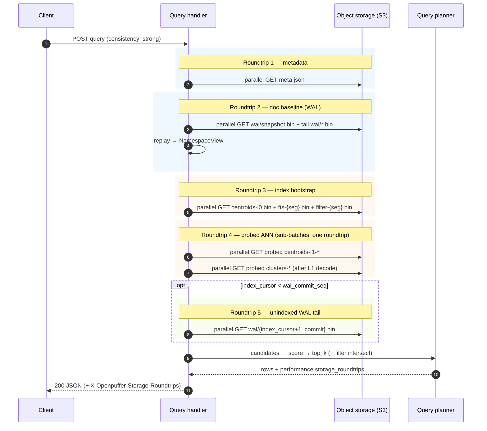

# openpuffer architecture (turbopuffer-aligned)

openpuffer is a stateless HTTP API backed by S3-compatible object storage. The on-disk layout and write path follow [turbopuffer’s architecture](https://turbopuffer.com/docs/architecture): a per-namespace **write-ahead log (WAL)** on object storage, asynchronous **index** builds under `index/`, and **namespace metadata** that tracks the index cursor and WAL commit point.

## Object storage layout

Each namespace is rooted at `openpuffer/{namespace}/`:

```
openpuffer/{ns}/
├── meta.json              # NamespaceMeta (index cursor, WAL commit, schema, distance metric)
├── wal/
│   ├── 00000001.bin       # WalEntry (bincode): batched upserts + patches + deletes
│   ├── 00000002.bin
│   └── ...
└── index/
    ├── fts-{segment_id:08}.bin   # BM25 inverted postings (bincode)
    ├── centroids-l0.bin            # coarse ANN centroid table (bincode)
    ├── centroids-l1-{coarse_id:08}.bin  # fine centroids per coarse cell
    ├── clusters-{fine_id:08}.bin   # doc id + vector per fine cluster
    └── ...
```

All durable state uses **WAL + index segments only**. There is no per-document `docs/{id}.json` or `manifest.json` layout. Namespaces without `meta.json` are treated as empty.

## FTS tokenization (BM25)

Indexing and queries share [`fts_tokenizer.rs`](../src/index/fts_tokenizer.rs):

1. **Unicode NFKC** normalization, then runs of Unicode letters and decimal digits (not naive ASCII `split`).
2. **Case folding** per token (`to_lowercase`).
3. **English stopwords** — a minimal function-word list (e.g. `the`, `and`, `is`) dropped at index and query time.
4. **Optional stemming** — Porter English stemmer when `OPENPUFFER_FTS_STEM=1` (or `true`/`yes`/`on`); **off by default**.

**Reindex:** a tokenizer change does **not** require a full namespace rebuild. Posting lists in existing `fts-{seg}.bin` files keep their prior term keys until those documents are upserted/deleted and merged into a **new** segment generation (the indexer always writes a fresh `fts-{wal_seq}.bin` per pass). Queries always use the current tokenizer; mixed old/new segments are safe and converge as WAL batches are re-indexed.

## Namespace metadata (`meta.json`)

| Field | Role |
|-------|------|
| `index_cursor` | Last WAL sequence number fully merged into `index/` (0 until indexer runs) |
| `wal_commit_seq` | Last durably committed WAL file (`wal/{seq:08}.bin`) |
| `schema` | JSON schema hints (attributes, vector dims) |
| `distance_metric` | ANN distance: `cosine_distance` (default) or `euclidean_squared` |
| `fts_segment_id` / `fts_segment_ids` | Latest FTS segment + generation chain (one file per indexer pass) |
| `filter_segment_id` / `filter_segment_ids` | Latest filter segment + chain |
| `vector_segment_id` / `vector_segment_ids` | WAL seq when `centroids-l0.bin` + `centroids-l1-*` + `clusters-*.bin` were last written |
| `vector_field` | Indexed vector attribute (e.g. `embedding`) |
| `dimensions` | Vector dimensionality (0 if no ANN index) |

Updates use **conditional PUT** (`If-Match` / `If-None-Match`) so concurrent writers serialize commits (compare-and-swap on `meta.json`). A per-namespace commit mutex ([`commit_lock.rs`](../src/commit_lock.rs)) ensures only one WAL append + meta CAS runs at a time; indexer CAS re-reads `meta.json` before commit so `wal_commit_seq` is never regressed.

## Write path

1. API accepts turbopuffer-shaped JSON (`upsert_rows`, `upsert_columns`, `deletes`).
2. Enqueue in per-namespace **write buffer** (`buffer.rs`): group commit by time (default 1s) or batch size.
3. Flush builds one `WalEntry` batch (upserts + attribute patches + deletes). Patches merge into existing docs on replay; missing ids ignored; vector fields cannot be patched. `delete_by_filter` / `patch_by_filter` resolve matching doc ids via the filter index + unindexed WAL tail (same strong-consistency path as query filters).
4. Assign `seq = wal_commit_seq + 1`.
5. **PUT** `wal/{seq:08}.bin` — v1 wire format: `[0x01][bincode WalEntry][crc32 LE]` (IEEE CRC over payload). Legacy segments without the version byte remain readable. Replay verifies CRC on v1 segments; corrupt segments log an error and abort load by default (`OPENPUFFER_WAL_CORRUPT_POLICY=fail`); `skip` continues after prior segments.
6. **CAS** update `meta.json`: set `wal_commit_seq = seq` (retries on `PreconditionFailed`).
7. **Wake** the async background indexer (non-blocking).
8. HTTP ACK only after steps 5–6 succeed (**strong consistency**). Index build is **not** on the ACK path.

```mermaid
sequenceDiagram
    autonumber
    participant C as Client
    participant API as HTTP API
    participant BUF as Write buffer
    participant S3 as Object storage (S3)
    participant IDX as Background indexer

    C->>API: POST write (upsert / patch / delete)
    API->>BUF: enqueue batch (upserts + patches + deletes)
    Note over BUF: group commit ≤1/s per namespace<br/>or max_batch_ops (512)

    BUF->>BUF: flush timer or batch full
    BUF->>S3: PUT wal/{seq:08}.bin
    BUF->>S3: CAS meta.json (wal_commit_seq = seq)
    BUF-->>IDX: wake(namespace) — non-blocking
    BUF-->>API: durable commit ok
    API-->>C: 200 ACK (strong consistency)

    Note over IDX,C: Index build is async;<br/>not on the write ACK path
```

Optional **`block_until_indexed: true`** on the write body blocks the HTTP response until the background indexer catches up (`index_cursor == wal_commit_seq`), up to **30s** (504 on timeout). Intended for tests and clients that need indexed segments before proceeding; default writes remain decoupled.

### Schema types (`schema` on write)

Declared in `meta.json` and merged on each write. Inferred types work for strings and vectors; non-inferrable types must be declared explicitly (turbopuffer [`write` schema](https://turbopuffer.com/docs/write#param-schema)):

| Type | Write validation | Filters |
|------|------------------|---------|
| `uuid` | Canonical lowercase RFC 4122 string | `Eq`, `Ne`, `In`, … |
| `[]uuid` | Array of canonical UUID strings | — |
| `datetime` | RFC3339 / ISO8601 string → canonical UTC `YYYY-MM-DDTHH:MM:SS.fffffffffZ` (9-digit subseconds) | `Eq`, `Gt`, `Lt`, … (lexicographic on canonical form) |

### Conditional upserts (`upsert_condition`)

Optional filter evaluated per row against the **committed** doc map (plus unflushed buffer overlay). Missing ids are always inserted; existing ids are updated only when the condition passes on the current row ([turbopuffer `upsert_condition`](https://turbopuffer.com/docs/write#param-upsert_condition)).

**Insert if not exists** (skip overwrites):

```json
["id", "Eq", null]
```

**Newer timestamp** (only apply when incoming `updated_at` is newer; requires `updated_at` in schema as `datetime`):

```json
[
  "Or",
  [
    ["updated_at", "Lt", {"$ref_new": "updated_at"}],
    ["updated_at", "Eq", null]
  ]
]
```

`{"$ref_new": "field"}` resolves the comparison value from the incoming upsert row. With canonical `datetime` strings, `Lt` is chronological order.

### Conditional patches (`patch_condition`)

Same filter DSL as `upsert_condition`, evaluated per `patch_rows` / `patch_columns` row against the **committed** doc map (plus unflushed buffer overlay). Missing ids are **ignored** without evaluating the condition ([turbopuffer `patch_condition`](https://turbopuffer.com/docs/write#param-patch_condition)). Does not apply to `patch_by_filter`.

**Patch only when status matches:**

```json
["status", "Eq", "active"]
```

`rows_patched` counts only rows where the condition passed and the patch was written.

### Conditional deletes (`delete_condition`)

Same filter DSL, evaluated per id in `deletes` against the **committed** doc map (plus unflushed buffer overlay). Missing ids are **ignored** without evaluating the condition ([turbopuffer `delete_condition`](https://turbopuffer.com/docs/write#param-delete_condition)). Does not apply to `delete_by_filter`. `{"$ref_new": "field"}` always resolves to null (not the delete id).

**Delete only when status matches:**

```json
["status", "Eq", "archived"]
```

`rows_deleted` counts only rows where the condition passed and the delete was written.

**Write response** (turbopuffer [`write` response](https://turbopuffer.com/docs/write) subset): `rows_affected`, optional `rows_upserted` / `rows_patched` / `rows_deleted`, and `billing.billable_logical_bytes_written` (v1 estimate: 64 bytes × affected rows per request).

### Write throughput limits (v1)

Aligned with [turbopuffer limits](https://turbopuffer.com/docs/limits) (per-namespace write throughput is capped in production; openpuffer enforces a **hard** WAL commit rate).

| Limit | Default | Notes |
|-------|---------|-------|
| Group-commit delay | 1s (`OPENPUFFER_WRITE_MAX_DELAY_MS`) | Batches in-memory writes per namespace before one WAL PUT |
| **Max WAL commits / s / ns** | **1** (`min_commit_interval` = `max_delay`) | **Enforced:** after a durable commit, the next flush waits until 1s elapsed; writes during the wait batch into memory. `flush_all` on shutdown bypasses this. |
| Max batch ops | 512 (`OPENPUFFER_WRITE_MAX_BATCH_OPS`) | Schedules a flush when upserts + patches + deletes reach this count, but the flush still waits on the 1s commit cooldown if a commit happened recently |
| Meta CAS retries | 8 | Exponential backoff 50ms × attempt; orphan WAL segment deleted on conflict |
| Concurrent HTTP writers | Serialized per namespace | Commit lock + S3 `If-Match` on `meta.json`; safe parallel clients, one WAL seq at a time |
| Practical throughput | ~1 WAL commit / s / ns | Raising `OPENPUFFER_WRITE_MAX_DELAY_MS` lowers commit rate; lowering it below 1000ms also lowers `min_commit_interval` (same env var drives both today) |
| Max write body | **64 MiB** | HTTP `400` with clear JSON error if exceeded |
| Max upsert rows / request | **10,000** (`OPENPUFFER_MAX_UPSERT_ROWS`) | Counts `upsert_rows`, `upsert_columns`, `patch_rows`, `patch_columns`, `deletes`; filter ops excluded |
| Max namespace name | **128** chars, `[A-Za-z0-9-_.]{1,128}` | Validated on all namespace path routes |
| `delete_by_filter` / `patch_by_filter` batch | **5,000** docs (`OPENPUFFER_MAX_FILTER_BATCH_ROWS`) | Default fails with `400` if more matches; `delete_by_filter_allow_partial` / `patch_by_filter_allow_partial` truncates and sets `rows_remaining: true` |
| Payload size (turbopuffer prod) | — | turbopuffer allows up to 512 MiB per write request |

## Local disk cache (index segments)

Optional NVMe-style cache for **index objects only** ([`cache.rs`](../src/cache.rs)) — not WAL or `meta.json`.

| Setting | Behavior |
|---------|----------|
| `--cache-dir` / `OPENPUFFER_CACHE_DIR` (default `/tmp/openpuffer-cache`) | Mirror `index/*` under `{cache_dir}/{bucket}/{s3_key}` |
| Empty `--cache-dir=""` | Memory-only: every index load uses S3 directly |

**Warm vs cold query:**

| Path | What happens |
|------|----------------|
| **Cold** | No disk cache (`--cache-dir=""`): three-roundtrip planner ([`s3_batch.rs`](../src/s3_batch.rs)) — round 1 meta+WAL, round 2 L0+FTS+filter, round 3 probed L1+clusters; optional round 4 unindexed WAL tail; `performance.storage_roundtrips` on query JSON |

### Cold query (`s3_batch` roundtrips)

With `--cache-dir=""`, a **strong** query uses [`plan_cold_query`](../src/s3_batch.rs): parallel `GetObject` **sub-batches** within a round still count as one logical `storage_roundtrip` (~100ms RTT). Typical path on a **caught-up** namespace (`index_cursor == wal_commit_seq`): round 1 meta+WAL (on first open), round 2 L0+FTS+filter, round 3 probed L1+clusters → **`storage_roundtrips` ≤ 4** (often **2** when the view is already pinned). With `index_cursor < wal_commit_seq`, add round 4 for the unindexed WAL tail.


| **Cold (cached)** | No local file (or etag stale after HEAD): `GetObject` from S3, write bytes + etag sidecar |
| **Warm** | Local file + HEAD etag match: serve from disk (no `GetObject`) |
| **Prefetch** | After `centroids-l0.bin` loads, background task fetches all `centroids-l1-*` + `clusters-*.bin` into cache for follow-up ANN queries |

**Indexer:** each `PutObject` for FTS / filter / vector segments writes S3 first, then populates the cache from the response etag.

## Warm cache (`POST /v1/namespaces/{name}/warm`)

Turbopuffer [`hint_cache_warm`](https://turbopuffer.com/docs/warm-cache) analogue ([`warm.rs`](../src/warm.rs)):

1. **Prefetch** `meta.json`, current FTS/filter/`centroids-l0` + all L1/cluster segments, and recent WAL tail (up to 128 segments) into the disk cache via HEAD+GET when needed.
2. **Pin** a fully caught-up [`NamespaceView`](../src/view.rs) in the in-process LRU map ([`view_cache.rs`](../src/view_cache.rs), default max 32 namespaces via `OPENPUFFER_MAX_PINNED_NAMESPACES`).
3. Return `200` JSON with `duration_ms`, segment counts, and `s3_get_count` for the warm pass.

After warm, queries against the same process reuse the pinned view. With `consistency: "strong"`, each query still `catch_up`s new WAL from S3 when `wal_commit_seq` advanced. With `consistency: "eventual"`, the pinned view and indexes are reused without WAL or meta refresh — index loads hit disk cache (HEAD only, no `GetObject` when etags match).

## Read path / query planner

**Implemented** ([`search.rs`](../src/search.rs)):

1. Load `meta.json` + FTS/vector `index/` segments (disk cache when enabled) + in-process [`NamespaceView`](../src/view.rs) (incremental WAL catch-up).
2. **Candidate generation** per `rank_by` subtree:
   - BM25: FTS posting-list union + top posting hits (indexed docs only).
   - Vector: ANN centroid probe + cluster member ids (indexed docs only).
   - **Sum:** union child candidate sets; **Product:** intersection.
3. **Score only candidates** (no full-namespace scan when indexes exist).
4. **Hybrid** `Sum` / `Product`: min-max normalize each sub-ranker over the shared candidate set, then combine.
5. Merge sort + `top_k` truncation.

**Consistency** (query body `consistency`):

| Mode | Behavior |
|------|----------|
| `strong` (default) | Indexed segments + exhaustive scoring for doc ids touched in unindexed WAL tail `(index_cursor, wal_commit_seq]`. Queries never block on the background indexer. Pinned views run `catch_up` (meta HEAD + new WAL segments) before each query. |
| `eventual` | Indexed segments only; **no** unindexed WAL tail fetch or planner tail scan. Pinned views are reused as-is (no `catch_up`). Very recent writes may be invisible until the background indexer advances `index_cursor`. |

**Eventual fast path (turbopuffer sub-10ms warm goal):** after `POST …/warm`, a query with `consistency: "eventual"` and a disk-cache hit loads index segments via HEAD+local file only and skips all S3 WAL I/O. Staleness is bounded by **indexing lag**: results reflect the last merged `index_cursor`, not `wal_commit_seq`. Use `strong` when you need read-your-writes before the indexer catches up; use `eventual` for lowest-latency ANN/FTS over the indexed snapshot.

**Performance observability** (turbopuffer [`performance`](https://turbopuffer.com/docs/query#responsefield-performance) subset):

| Field | Meaning |
|-------|---------|
| `approx_namespace_size` | Live doc count in the namespace view |
| `candidates` | Doc ids after candidate generation (+ filters) |
| `candidates_ratio` | `candidates / approx_namespace_size` — indexed ANN/FTS should stay ≪ 1 |
| `exhaustive_search_count` | Docs scanned via full-namespace fallback or unindexed WAL tail |
| `query_execution_us` | Planner + score time on the server |
| `billing.billable_logical_bytes_queried` | v1 estimate: `candidates × avg_doc_logical_bytes` over the namespace view |
| `billing.billable_logical_bytes_returned` | Sum of returned row payloads (id + projected attributes) |

HTTP headers: `X-Openpuffer-Candidates`, `X-Openpuffer-Candidates-Fraction` (`candidates/total`).

Regression guard: `cargo test --features perf` runs `tests/perf_namespace.rs` (5k docs, 128-dim ANN) and asserts `candidates_ratio < 0.12` (not O(n); two-level probe fetches ~`4×2` fine clusters plus tail).

## Background indexer

```mermaid
sequenceDiagram
    autonumber
    participant IDX as Background indexer
    participant S3 as Object storage (S3)

    Note over IDX: tick every 500ms or wake() after write flush

    IDX->>S3: discover namespaces (index_cursor < wal_commit_seq)
    loop fair round-robin per lagging namespace
        IDX->>S3: GET wal/{index_cursor+1..wal_commit_seq}.bin
        IDX->>S3: GET latest fts / filter / vector segments
        IDX->>IDX: apply_delta (BM25 postings, filter map, ANN assign)
        IDX->>S3: PUT fts-{seq}.bin, filter-{seq}.bin,<br/>centroids-l0, centroids-l1-*, clusters-*
        IDX->>S3: CAS meta.json (index_cursor, segment ids)
    end
    opt caught up and wal_commit_seq > 10
        IDX->>S3: PUT wal/snapshot.bin
        IDX->>S3: DELETE wal/{seq:08}.bin (seq ≤ index_cursor − 3)
        IDX->>S3: CAS meta.json (wal_snapshot_seq)
    end
    Note over IDX: errors → re-queue; writes never blocked
```

Indexing is **decoupled from the write hot path** ([`BackgroundIndexer`](../src/indexer.rs)):

1. After each durable WAL flush, the write buffer **notifies** the indexer (`wake`) — no await on index build.
2. A single tokio background task runs continuously:
   - Waits up to **500ms** or until notified.
   - Discovers namespaces where `index_cursor < wal_commit_seq` (pending `wake` + S3 prefix scan).
   - **Fair scheduling:** round-robin queue reprioritized each tick by descending `(wal_commit_seq - index_cursor)`. When several namespaces compete with small lag, index **one** WAL segment per namespace per tick with a **2s** time slice. When a namespace is alone or lag ≥ 8, index up to **8** segments per tick with no time slice (10k-doc catch-up on MinIO). Mid lag (4–7) indexes **2** segments per tick under fair mode.
   - **Compaction pass:** after each tick, any namespace with `index_cursor == wal_commit_seq` and `wal_snapshot_seq < index_cursor` runs `maybe_compact_wal` (re-compact after a prior partial snapshot while WAL was still growing).
3. For each lagging namespace (time-boxed slice):
   - Read WAL from `index_cursor + 1` through `wal_commit_seq`.
   - **FTS:** load latest `fts-{id}.bin`, `apply_delta` from WAL batch only, write `fts-{seq}.bin`, append `fts_segment_ids`.
   - **Filter:** load latest filter segment, `apply_delta` (no full WAL replay).
   - **Vector ANN:** load L0/L1 + clusters, `apply_delta` (two-level nearest-centroid assign for new docs); **full k-means rebuild** only when `doc_count > num_fine_total × 4` (see below). Writes `centroids-l0.bin`, `centroids-l1-{coarse}.bin`, `clusters-{fine}.bin`, appends `vector_segment_ids`.
   - CAS-advance `index_cursor` in `meta.json`.
   - When caught up and `wal_commit_seq > 10`, compact indexed WAL: write `wal/snapshot.bin`, delete `wal/{seq:08}.bin` for `seq <= index_cursor - 3`, set `wal_snapshot_seq` in meta. Cold load replays snapshot + tail WAL only.
4. On indexer errors: log, re-queue namespace, **retry** on next tick — writes are never blocked.

**Metadata API:** `GET /v1/namespaces/{name}` exposes `index_cursor`, `wal_commit_seq`, `approx_row_count` (view or WAL replay), `unindexed_bytes` (HEAD sum of WAL segments after `index_cursor`), and `index_status` (`catching_up` | `up_to_date`). `GET /v1/namespaces` returns the same per-ns fields except row count.

**Health:** `GET /health` returns `{status:"ok"}`. With `?deep=1`, probes S3 (`HeadBucket`, list `openpuffer/`, HEAD canary `meta.json` when a namespace exists); returns `{status:"degraded",s3:"unavailable"}` with HTTP 503 if S3 is unreachable.

### Vector ANN (SPFresh-inspired, two-level)

[turbopuffer SPFresh](https://turbopuffer.com/docs/architecture) uses hierarchical centroid clustering, re-ranking, and object-storage–friendly segments. openpuffer implements a **two-level** hierarchy:

| SPFresh / turbopuffer | openpuffer v1 |
|----------------------|---------------|
| Multi-level centroid hierarchy | **L0** coarse k-means (≤16 cells) + **L1** fine k-means per coarse (`k_fine ≈ √n_cell`, cap 256) |
| Incremental cluster maintenance | Incremental two-level assign; full rebuild when `doc_count > num_fine_total × 4` |
| Re-rank with fresh vectors from WAL | Optional `OPENPUFFER_ANN_RERANK` / `--ann-rerank`: full probed-cluster pool exact-scored from view; default probe-only uses cluster-vector `query_ann` pool |
| Many small segments + merges | `centroids-l0.bin` + `centroids-l1-{coarse:08}.bin` + `clusters-{fine:08}.bin` |

**Build:** coarse k-means partitions the namespace; each coarse cell runs fine k-means (10 Lloyd iterations). Centroid seeds use **k-means++** initialization (weighted by squared distance to nearest existing center) instead of the first *k* doc vectors. Global fine ids are `fine_counts` offsets in L0. Cluster files list `(doc_id, vector)` for cosine (or negated L2²) scoring.

**Probe tuning (serve / indexer):** `openpuffer serve` accepts `--ann-coarse-probe` / `--ann-fine-probe` (env `OPENPUFFER_ANN_COARSE_PROBE`, `OPENPUFFER_ANN_FINE_PROBE`; defaults **4** and **2**). Values are written into `centroids-l0.bin` (`probe_coarse`, `probe_fine`) on each full vector index build. Higher probes improve recall at the cost of more S3 objects fetched per query (`performance.candidates`, `storage_roundtrips`). Re-index or rebuild after changing probes so L0 metadata matches.

**Re-rank (query, optional):** `--ann-rerank` / `OPENPUFFER_ANN_RERANK=1` widens the ANN candidate pool to every doc in probed clusters, then ranks with **exact** vectors from the in-memory view (including WAL tail updates). Probe-only (default) keeps a smaller pool from per-cluster `query_ann` truncation; `performance.candidates_ratio` is typically **higher** with re-rank enabled. Lib gate: `recall_at_10_10k_with_rerank_at_least_point_nine_two` (recall@10 ≥ 0.92 on the 10k synthetic fixture).

**Query (`rank_by: ["vector", "ANN", field, query]`):**

1. Load `centroids-l0.bin`, pick top-*C* coarse centroids (*C* = `probe_coarse`, default 4; all coarse if `num_fine_total ≤ 32`).
2. Fetch probed `centroids-l1-{coarse}.bin` files, then top-*F* fine centroids per coarse (*F* = `probe_fine`, default 2).
3. Fetch only matching `clusters-*.bin` objects from S3 (cold query round 2 uses this subset; full cold load fetches all L1 + clusters).
4. Score members in probed clusters; merge with **exhaustive** cosine on docs touched in unindexed WAL tail `(index_cursor, wal_commit_seq]`.

Distance uses `distance_metric` from `meta.json` (`cosine_distance` default).

## Query phases (turbopuffer model)

| Phase | Source | Iteration |
|-------|--------|-----------|
| Metadata | `meta.json` | 1 |
| Indexed ANN / FTS | `index/*` | 3–4 (implemented) |
| Unindexed tail | `wal/*.bin` after `index_cursor` | 1 (full replay), 6 (tail only) |
| Filters | `index/filter-{seg:08}.bin` | 7 (implemented) |

**Filters (`filters: ["field", "Eq", value]` …):**

1. Parse turbopuffer-style DSL: `Eq`, `Ne`, `Gt`, `Gte`, `Lt`, `Lte`, `In`, `And`, `Or` (unsupported ops → 400).
2. Load inverted filter segment from S3: `(field, value_key) → doc_id` sets.
3. Intersect filter matches with ANN/FTS **candidates before scoring**; WAL tail docs re-evaluated with `eval_filter` under strong consistency.

## Consistency

- **Strong (default):** query after write reads up to `wal_commit_seq`.
- **Eventual:** optional later; may skip latest WAL for lower latency.

## References

- [turbopuffer Architecture](https://turbopuffer.com/docs/architecture)
- [Write API](https://turbopuffer.com/docs/write)
- [Query API](https://turbopuffer.com/docs/query)
- [Namespace metadata](https://turbopuffer.com/docs/metadata)