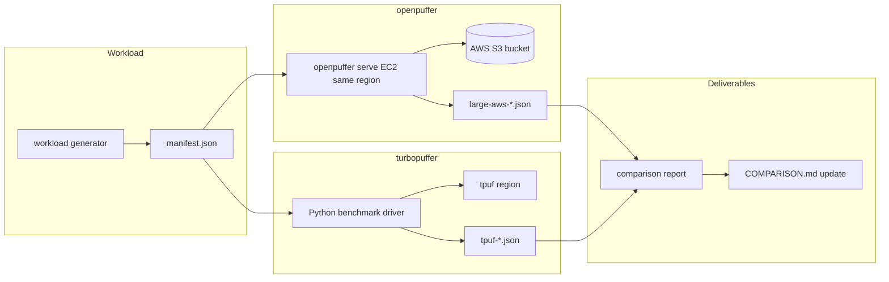

# Plan: large-dataset benchmarking, testing, and turbopuffer comparison

End-to-end program to load a **large-ish** namespace (primary target **1M**), prove correctness under real object storage, measure openpuffer performance, and publish an **apples-to-apples comparison report** against **managed turbopuffer** (not docs-only reference numbers).

This plan complements implementation-focused [PLAN_SPFRESH_AND_COLD_1M.md](PLAN_SPFRESH_AND_COLD_1M.md) and operator runbooks in [BENCHMARKS.md](BENCHMARKS.md). It does not replace them: those docs define *gates*; this doc defines the *full evaluation program* and the *comparison report*.

**Harness status:** automation through Phase 8 A1–A6 and G2 MinIO gates is in-repo (`facts check --tags bench-large` / `bench-tpuf`). Live G3–G5 (AWS + tpuf JSON + measured report) remain operator-owned — see [Unresolved assumptions](#unresolved-assumptions) and [Verification checklist](#verification-checklist-program-complete).

---

## Goals and non-goals

### Goals

| # | Goal | Done when |
|---|------|-----------|
| G1 | **Reproducible workload** — same vectors, ids, filters, and query set for both systems | Checked-in generator + manifest (`benchmarks/workloads/`) |
| G2 | **Correctness** — API semantics, recall, hybrid/filter paths before latency claims | Integration + recall gates pass on shared fixture |
| G3 | **openpuffer scale proof** — 100k+ on AWS S3 with committed JSON artifacts | `benchmarks/results/large-aws-*.json` in repo |
| G4 | **turbopuffer baseline** — same workload on production API in a chosen region | `benchmarks/results/tpuf-*.json` + API key redacted in report |
| G5 | **Comparison report** — structured markdown with methodology, raw numbers, interpretation | `docs/reports/BENCHMARK_VS_TURBOPUFFER_<date>.md` |
| G6 | **Regression harness** — CI/nightly stays MinIO; AWS/tpuf runs are manual but scripted | Documented commands; optional future CI secret job |

### Non-goals

- Claiming parity with turbopuffer fleet SPFresh, pinning, or multi-region control plane.
- Using **MinIO** timings in the turbopuffer comparison report (MinIO = correctness only; see [BENCHMARKS.md](BENCHMARKS.md)).
- Free-tier or cost-optimized turbopuffer testing (use a dedicated test org/namespace per [turbopuffer Testing](https://turbopuffer.com/docs/testing)).
- Public dataset embedding (e.g. full MS MARCO) unless licensing and ingest time are explicitly scoped.

---

## “Large-ish” dataset definition

| Tier | Documents | Vector dim | Primary use | openpuffer harness | turbopuffer harness |
|------|-----------|------------|-------------|--------------------|---------------------|
| **L1** | 100k | 128 f32 | **Primary comparison** — fits nightly MinIO + overnight AWS | `bench_cold_100k_nightly`, lib recall gates | Same ingest + recall + cold query suite |
| **L2** | 250k–500k | 128 f32 | Stress indexer lag, object count, recall drift | Extend `bench-1m.sh` pattern (`OPENPUFFER_BENCH_DOCS`) | Same; watch billing on recall |
| **L3** | 1M | 128 f32 | Cold latency SLO (existing program) | [`scripts/bench-1m.sh`](../scripts/bench-1m.sh) | Optional; higher cost/time |

**Default comparison tier: L1 (100k)** unless the report explicitly states L2/L3.

### Workload shape (both systems)

Use **synthetic, deterministic** data so runs are diffable without storing 100k×128 floats in git:

- **Ids:** `doc-{i}` via `id_scheme: doc-prefix` in committed manifests (generator also supports `u64`; **do not mix** across a comparison run). See `benchmarks/workloads/synthetic-128/*/manifest.json`.
- **Vectors:** seeded PRNG per id (same seed in generator for openpuffer and tpuf).
- **Attributes (optional but recommended for hybrid/filter tests):**
  - `category`: one of 8 values (filter `In` tests).
  - `title`: short string (FTS smoke).
  - `priority`: int for `order_by` tie-break tests.
- **Schema:** `embedding` as `[128]f32`, `distance_metric: cosine_distance`.
- **ANN index:** openpuffer `OPENPUFFER_ANN_VERSION=3` on serve before ingest; turbopuffer uses default production index (no equivalent flag).

Store a small **query set** (e.g. 50 vectors + 10 filter/hybrid specs) as JSON beside the generator manifest.

---

## Architecture of the evaluation



**Fairness rule:** the benchmark **client** (EC2 or laptop) should sit in the **same cloud region** as openpuffer’s S3 bucket and as the chosen turbopuffer region. Record RTT with `curl -w '%{time_connect}'` to both endpoints before trusting latency deltas.

---

## Phase 0 — Prerequisites and inventory

### Accounts and secrets

| Item | openpuffer | turbopuffer |
|------|------------|-------------|
| Storage | AWS S3 bucket (dedicated `openpuffer-bench-*`) | Managed (per namespace) |
| Credentials | `OPENPUFFER_S3_*` | `TURBOPUFFER_API_KEY` (env, never commit) |
| Isolation | One namespace per run: `bench-op-<date>-<tier>` | `bench-tpuf-<date>-<tier>` per [Testing](https://turbopuffer.com/docs/testing) |
| Cleanup | `DELETE /v1/namespaces/{name}` + empty prefix | `namespace.delete_all()` in driver `finally` |

### Toolchain

- Rust **release** `openpuffer` with features `bench`, `integration` as needed.
- `curl`, `jq`, `python3`, optional `aws` CLI.
- Python: `turbopuffer` SDK (`pip install turbopuffer`), `pytest` for driver tests.
- Docker: only for **MinIO** preflight (`./scripts/run-integration-s3.sh`), not for AWS comparison runs.

### Baseline inventory (already in repo)

Record these commit SHAs in every report:

| Artifact | Tier | Environment |
|----------|------|-------------|
| [`benchmarks/results/baseline-10k.json`](../benchmarks/results/baseline-10k.json) | 10k | MinIO |
| [`benchmarks/results/cold-50k-v3.json`](../benchmarks/results/cold-50k-v3.json) | 50k v3 | MinIO |
| [`benchmarks/results/nightly-100k.json`](../benchmarks/results/nightly-100k.json) | 100k | MinIO |
| `benchmarks/results/1m-aws.json` | 1M | AWS (pending) |

### Fact sheet

`@spec` facts for the comparison harness (tags `bench-large`, `bench-tpuf`) live in [`.facts`](../.facts); verify with `facts check --tags bench-large` (15 facts) and `facts check --tags bench-tpuf` (6 facts, overlap with bench-large) ([BENCHMARKS.md](BENCHMARKS.md#facts)).

**Covered by `@spec` + `@implemented` today:** A1–A5 scripts, G2 gates, G3 `run-aws-large-benchmark.sh`, G4 `run-tpuf-large-benchmark.sh`, MinIO schema example JSON, Phase 3.3 id-overlap dry-run, A6 dispatch id-overlap + tpuf dry-run, report merge fixtures, exemplar `NOT MEASURED` report.

**Pending manual facts** (add `@spec` when artifacts exist, then `@implemented` after commit):

- “L1 AWS cold bench JSON exists with `environment=aws-s3`, `storage_roundtrips ≤ 4`, `preferred_ann_version == 3`.” → `benchmarks/results/large-aws-l1.json`
- “L1 tpuf bench JSON exists with `tpuf_region` set and `cold_query_runs == 7`.” → `benchmarks/results/tpuf-l1.json`
- “Measured comparison report documents tpuf region and openpuffer S3 region (not NOT MEASURED).” → `docs/reports/BENCHMARK_VS_TURBOPUFFER_YYYY-MM-DD.md`
- “Live id-overlap JSON from both indexed namespaces.” → `benchmarks/results/id-overlap-l1.json`

---

## Phase 1 — Workload generator and manifest

**Deliverable:** `benchmarks/workloads/synthetic-128/{l1-100k,l2-500k,l3-1m}/` (committed; seed 42).

### 1.1 Generator script

Implement `benchmarks/workloads/generate_synthetic.py` (or Rust binary) that:

1. Writes `manifest.json`: `seed`, `num_docs`, `dim`, `batch_size`, `id_scheme`, attribute definitions.
2. Streams **upsert batches** compatible with:
   - openpuffer: `POST /v2/namespaces/{ns}` with `upsert_columns` (10k rows/batch).
   - turbopuffer: `namespace.write(upsert_columns=...)` or `upsert_rows` with same column names.
3. Emits `queries.json`: vector queries, hybrid specs, filter-only queries (fixed count).

**Determinism:** same `seed` + `num_docs` → identical vectors on both sides.

### 1.2 Ingest cadence (openpuffer)

Follow [BENCHMARKS.md § 1M ingest cadence](BENCHMARKS.md#1m-ingest-cadence) scaled to tier:

| Tier | Batches (10k) | Sleep between batches | Wall time (ingest only) |
|------|---------------|------------------------|-------------------------|
| 100k | 10 | ~1.1s | ~12–15 min |
| 500k | 50 | ~1.1s | ~60–70 min |
| 1M | 100 | ~1.1s | ~17–20 min |

**Do not** use `block_until_indexed: true` for large tiers; poll `GET /v1/namespaces/{name}` until `index_cursor == wal_commit_seq` and `preferred_ann_version == 3`.

### 1.3 Ingest (turbopuffer)

- Use **large write batches** (up to 512 MiB per [limits](https://turbopuffer.com/docs/limits)); for 128-dim f32, 10k rows per batch is safe.
- Reuse **one SDK client** for connection pooling ([Performance](https://turbopuffer.com/docs/performance)).
- Record `rows_affected` and wall time per batch in driver logs.

---

## Phase 2 — Environment setup

### 2.1 openpuffer on AWS

| Step | Action |
|------|--------|
| 1 | Create S3 bucket in target region (e.g. `us-east-1`); enable versioning optional for forensics. |
| 2 | Launch **EC2** in **same region** (e.g. `c6i.large`); install release binary or build on host. |
| 3 | Run `openpuffer serve` with: `--ann-version 3`, `--cache-dir ""` for cold runs, `OPENPUFFER_COLD_S3_CONCURRENCY=32` (tune 32→64 if RTT-bound). |
| 4 | Optional warm runs: non-empty `--cache-dir` + `POST /v1/namespaces/{ns}/warm` before query phase. |
| 5 | Enable metrics if comparing operator view: `cargo build --release --features metrics`, scrape `GET /metrics`. |

**Security:** no public ingress required; SSH tunnel or private VPC. Comparison client can be the same EC2 host as `serve` (localhost) to isolate **server** latency from client WAN—document which mode was used.

### 2.2 turbopuffer managed

| Step | Action |
|------|--------|
| 1 | Pick region closest to EC2 (e.g. `aws-us-east-1` / `gcp-us-central1` per [Regions](https://turbopuffer.com/docs/regions)). |
| 2 | Create ephemeral namespace; delete in `finally`. |
| 3 | Ingest via Python driver using shared generator output. |
| 4 | Poll namespace metadata until indexed (tpuf `index_status` / row counts stable—mirror openpuffer’s `index_cursor` check). |

### 2.3 MinIO preflight (correctness only)

Before spending AWS/tpuf budget:

```bash
cargo test -F integration --test integration_s3 -- --nocapture
cargo test -F bench --test bench_cold -- --nocapture
cargo test --release -F bench --test bench_cold -- --ignored --nocapture   # 100k
```

Failures here block Phase 3–7.

---

## Phase 3 — Functional testing (correctness before performance)

Run on **MinIO** (CI) and spot-check on **AWS** after first large ingest.

### 3.1 API parity smoke

| Area | openpuffer check | turbopuffer check |
|------|------------------|-------------------|
| Write ACK | `wal_commit_seq` advances | write response success |
| Strong read | query sees last upsert | same |
| Vector query | `performance` block present | `performance` if exposed |
| Recall | `POST …/recall` → `avg_recall`, counts | `namespace.recall()` same fields |
| Errors | `{"error","status":"error"}` | SDK `APIError` shape |

Existing integration coverage: `tests/integration_s3.rs` (53+ scenarios). Re-run subset after large ingest: `recall_http_*`, `ten_thousand_docs_indexed_query`, `cold_hybrid_10k_*`.

### 3.2 Recall equivalence

On **fully indexed** namespace at comparison tier:

| System | Call | Gate (starting point) |
|--------|------|------------------------|
| openpuffer | `POST /v1/namespaces/{ns}/recall` `num=20, top_k=10` | `avg_recall ≥ 0.85` (1M gate); aim **≥ 0.90** @ 100k |
| turbopuffer | `recall(num=20, top_k=10)` | Record actual; typically high on synthetic uniform data |

**Important:** recall compares ANN vs exhaustive **within each product’s engine**. Cross-system recall equality is not required; report both numbers side by side.

### 3.3 Result correctness spot-check

For 10 fixed queries from `queries.json` (`spot_check` block; first `vector_queries`):

1. Export or query `top_k=10` with `include_attributes`.
2. Compare **id overlap** between systems only where distance metric and ranking are defined identically (pure vector ANN, same query vector).
3. Document expected divergence (different ANN graphs, probes).

**Automation:** [`benchmarks/cross_check/run_spotcheck.py`](../benchmarks/cross_check/run_spotcheck.py) / [`scripts/run-id-overlap-spotcheck.sh`](../scripts/run-id-overlap-spotcheck.sh) → `benchmarks/results/id-overlap-{tier}.json`. CI-safe: `--dry-run` and `--mock` (no API key). Live run after both namespaces are indexed.

### 3.4 Load and soak (optional)

- Sustained query load: 10 min @ 10 QPS cold cache-bust between queries.
- Watch: indexer lag (`index_cursor < wal_commit_seq`), OOM on `serve`, S3 throttling (`503` SlowDown).

---

## Phase 4 — Performance evaluation

### 4.1 Metrics matrix

Collect the same **logical** metrics where APIs allow:

| Metric | openpuffer source | turbopuffer source | Notes |
|--------|-------------------|--------------------|-------|
| Cold p50/p95 query latency | 7+ runs, empty cache each time | Same protocol | Client-side `time_total_ms` |
| Warm p50 latency | `--cache-dir` + warm endpoint | [Warm cache](https://turbopuffer.com/docs/warm-cache) | openpuffer `consistency: eventual` on pinned view |
| `storage_roundtrips` | `performance.storage_roundtrips` | May differ or be absent | openpuffer-specific; still report |
| S3 GET count | `cold_s3_keys_fetched`, debug cache-stats | N/A (opaque) | Explain in report |
| `candidates_ratio` | `performance.candidates_ratio` | tpuf `performance` if present | |
| `recall@10` | `/recall` or bench JSON | `recall()` | |
| Index object count | S3 `list-objects` under `index/` | Not applicable | openpuffer operability metric |
| Ingest duration | Wall clock + commit count | Wall clock | openpuffer ~1 commit/s/ns |
| Write throughput | docs/sec given batch cadence | docs/sec | Not comparable 1:1 due to WAL cap |

### 4.2 Cold query protocol (mandatory for comparison)

Identical client procedure:

1. **Indexed gate:** metadata shows catch-up complete.
2. **Cache bust (openpuffer):** empty `--cache-dir` or delete cache dir between runs; restart `serve` if needed.
3. **Cache bust (turbopuffer):** use fresh namespace or documented cache-cold approach (new namespace per cold series is simplest).
4. **Query:** vector-only `rank_by`, `top_k=10`, `consistency: strong`, minimal `include_attributes`.
5. **Repeat:** 7 cold runs (match [`bench_cold.rs`](../tests/bench_cold.rs)); report p50 and p95.
6. **Record** full JSON line per run (latency + performance block).

openpuffer automation (tiered; **not** `bench-1m.sh` for L1/L2):

```bash
# G3 one-shot (recommended): G2 subset → AWS preflight → ingest → bench
./scripts/run-aws-large-benchmark.sh --tier l1
# → benchmarks/results/large-aws-l1.json

# Or stepwise:
./scripts/ingest-large.sh --tier l1
./scripts/bench-large.sh --tier l1

# L3 (1M) still available via bench-large --tier l3 or legacy bench-1m.sh
```

### 4.3 Warm query protocol

1. `POST /v1/namespaces/{ns}/warm` (openpuffer) / tpuf warm API.
2. 20 queries without cache bust; `consistency: eventual` where applicable.
3. Compare p50 to turbopuffer’s sub-10ms **goal** ([ARCHITECTURE.md](ARCHITECTURE.md))—report honestly if not met at 100k+.

### 4.4 Hybrid and filter (secondary)

If report scope includes hybrid:

- openpuffer: `cold_hybrid_10k_*` pattern at 100k (FTS bootstrap + vector).
- turbopuffer: equivalent `rank_by` Sum/Product per [Hybrid](https://turbopuffer.com/docs/hybrid).
- Gates: `storage_roundtrips ≤ 4` (openpuffer); tpuf latency only.

### 4.5 Reference numbers (not a substitute for measurement)

Use published turbopuffer tradeoffs only as **context**, not as measured tpuf row in the report:

- Cold queries occasionally **100s of ms** P999; marketing **~400–500ms class @ 1M** on landing/docs.
- Consistent reads **~10ms floor**; warm **~14ms** class cited in [COMPARISON.md](COMPARISON.md).

**The report’s turbopuffer column must come from Phase 4.2 runs in your chosen region.**

---

## Phase 5 — Debugging playbook

When gates fail or numbers look wrong, work through this order.

### 5.1 Index not caught up

**Symptoms:** high `candidates_ratio`, low recall, slow queries scanning WAL.

| Check | Command / API |
|-------|----------------|
| Meta lag | `GET /v1/namespaces/{ns}` → `index_cursor`, `wal_commit_seq`, `index_status` |
| Unindexed bytes | `unindexed_bytes` > 0 |
| Fix | Wait; scale indexer fairness; reduce concurrent namespaces; inspect indexer logs |

### 5.2 Cold path fetching too much

**Symptoms:** `storage_roundtrips > 4`, `cold_s3_keys_fetched` scales with total clusters.

| Check | Where |
|-------|--------|
| Probed vs full load | `performance.ann_probed_clusters`, Prometheus `openpuffer_ann_probe_clamp_total` |
| Probe env | `OPENPUFFER_ANN_COARSE_PROBE`, `OPENPUFFER_ANN_FINE_PROBE`, `OPENPUFFER_ANN_MAX_PROBE_CLUSTERS` |
| ANN version | `preferred_ann_version` must be `3` for large-tier program |
| Code path | [`plan_cold_query`](../src/s3_batch.rs), [`fetch_cold_vector_probed`](../src/storage.rs) |

### 5.3 High latency but low roundtrips

**Symptoms:** `storage_roundtrips` ≤ 4 but p50 > 600ms on AWS.

| Check | Action |
|-------|--------|
| RTT | Run S3 GET latency from EC2; try `OPENPUFFER_COLD_S3_CONCURRENCY=64` |
| Region mismatch | Move EC2 or bucket |
| Strong consistency | WAL tail on large unindexed window—wait for catch-up |
| Instance size | CPU for decode/rerank; try `--ann-rerank` off for latency A/B |

### 5.4 Recall collapse

| Check | Action |
|-------|--------|
| v2 vs v3 | Re-index with `OPENPUFFER_ANN_VERSION=3` |
| Probes too low | Increase coarse/fine probe; watch `candidates_ratio` |
| Re-rank | Enable `OPENPUFFER_ANN_RERANK=1` for recall A/B (latency tradeoff) |
| Data drift | Confirm generator seed unchanged |

### 5.5 Write / ingest stalls

| Check | Action |
|-------|--------|
| 1 commit/s cap | Expected; do not compare ingest fairly to tpuf without noting cap |
| CAS conflicts | Retry storms in logs; reduce parallel writers |
| S3 errors | 503 SlowDown → backoff; check IAM |

### 5.6 turbopuffer-specific

| Issue | Action |
|-------|--------|
| 429 / rate limit | Smaller batch concurrency; retry with SDK backoff |
| Region latency | Re-run from closer region |
| Billing on recall | Reduce `num` on large namespaces per [Recall billing](https://turbopuffer.com/docs/recall#billing) |

### 5.7 Object storage forensics (openpuffer)

```bash
aws s3 ls s3://$BUCKET/openpuffer/$NS/ --recursive | head
aws s3 cp s3://$BUCKET/openpuffer/$NS/meta.json - | jq .
# WAL segments
aws s3 ls s3://$BUCKET/openpuffer/$NS/wal/
# Index footprint
aws s3 ls s3://$BUCKET/openpuffer/$NS/index/ | wc -l
```

Compare `index_object_count` in bench JSON with list count.

---

## Phase 6 — Assessing results

### 6.1 Pass/fail rubric (openpuffer)

Use existing gates from [BENCHMARKS.md](BENCHMARKS.md) at the tier you ran:

| Tier | storage_roundtrips | recall@10 | p50 cold (AWS) | candidates_ratio |
|------|-------------------|-----------|----------------|------------------|
| 100k MinIO | ≤ 4 | ≥ 0.88 (bench) / 0.90 (lib) | informational | < 0.20 |
| 100k AWS | ≤ 4 | ≥ 0.85–0.90 | **< 600ms** target | < 0.20 |
| 1M AWS | ≤ 4 | ≥ 0.85 | **< 600ms** target | < 0.20 |

### 6.2 Comparison interpretation (openpuffer vs tpuf)

| Outcome | Meaning |
|---------|---------|
| openpuffer cold p50 **within ~2×** tpuf @ same tier/region | Architecture competitive for self-hosted; tune probes/concurrency |
| openpuffer cold p50 **> 2×** tpuf | Investigate S3 RTT, probe clamp, rerank, indexer lag; not necessarily incorrect |
| openpuffer recall **<<** tpuf | Expected if v3 ANN simpler than prod SPFresh; tune probes/rerank |
| openpuffer recall **≈** tpuf | Strong signal on synthetic data; validate on real embeddings before product claims |
| openpuffer ingest **much slower** | Expected (~1 WAL commit/s); separate write-path report section |

### 6.3 When to block a release

- Any **correctness** regression on MinIO integration suite.
- `storage_roundtrips > 4` on caught-up strong cold vector query @ 10k/100k.
- `recall@10` below tier gate on AWS after indexing complete.
- Comparison report missing methodology (region, tier, seed, commit SHA).

---

## Phase 7 — Comparison report deliverable

**Path:** `docs/reports/BENCHMARK_VS_TURBOPUFFER_YYYY-MM-DD.md` (create `docs/reports/` on first run).

### 7.1 Required sections

1. **Executive summary** — 3–5 bullets: who should use openpuffer vs tpuf for this workload.
2. **Methodology** — tier, doc count, dim, seed, regions, instance types, cache policy, commit SHAs.
3. **Setup summary** — ingest duration, indexing wait time, namespace names (redacted if needed).
4. **Results tables** — copy template below.
5. **Correctness** — recall both sides; spot-check overlap note.
6. **Debugging notes** — failures encountered and fixes (reproducibility for the next run).
7. **Limitations** — WAL cap, API subset, no tpuf `storage_roundtrips`, billing not included unless measured.
8. **Appendix** — full JSON artifacts linked from `benchmarks/results/`.

### 7.2 Results table template

```markdown
## Results @ 100k × 128-dim cosine (synthetic seed=…)

| Metric | openpuffer (AWS us-east-1) | turbopuffer (region …) | Ratio (op/tpuf) |
|--------|---------------------------|-------------------------|-----------------|
| Ingest wall time | | | |
| Time to indexed | | | |
| Cold p50 query (ms) | | | |
| Cold p95 query (ms) | | | |
| Warm p50 query (ms) | | | |
| recall@10 (num=20) | | | |
| storage_roundtrips | | n/a | |
| cold_s3_keys_fetched | | n/a | |
| candidates_ratio | | | |
| index_object_count | | n/a | |

**Query protocol:** strong consistency, vector-only ANN, top_k=10, cache cold, 7 runs.
**Client:** EC2 localhost vs tpuf SDK from same host.
```

### 7.3 Updating [COMPARISON.md](COMPARISON.md)

After the report is accepted:

- Replace “manual gate pending” / “product reference” rows in [Maturity vs TurboPuffer](COMPARISON.md#maturity-vs-turbopuffer-measured) with measured tpuf + openpuffer AWS numbers.
- Link the report and JSON paths.
- Keep honest gaps (auth, multi-tenant, true SPFresh, write throughput).

---

## Phase 8 — Automation roadmap (implementation backlog)

Ordered work to make this plan one-command reproducible:

| # | Task | Output |
|---|------|--------|
| A1 | `benchmarks/workloads/generate_synthetic.py` + manifest | Shared data |
| A2 | `scripts/ingest-large.sh` (wraps generator + meta poll) | openpuffer ingest |
| A3 | `scripts/bench-large.sh` (+ G3 [`run-aws-large-benchmark.sh`](../scripts/run-aws-large-benchmark.sh)) | `benchmarks/results/large-aws-{l1,l2,l3}.json` |
| A4 | [`run-tpuf-large-benchmark.sh`](../scripts/run-tpuf-large-benchmark.sh) → `benchmarks/tpuf_driver/run_benchmark.py` | `benchmarks/results/tpuf-{l1,l2,l3}.json` |
| A5 | `scripts/render-report.sh` (merge JSON → markdown) | `docs/reports/BENCHMARK_VS_TURBOPUFFER_<date>.md` |
| A6 | [`benchmark-large-dispatch.yml`](../.github/workflows/benchmark-large-dispatch.yml) `workflow_dispatch` dry-run | CI not default (cost) |

**Operator wrappers (G3/G4)** — shared preflight in [`scripts/lib/large-benchmark-preflight.sh`](../scripts/lib/large-benchmark-preflight.sh):

| Script | Role | Default artifact |
|--------|------|------------------|
| [`run-aws-large-benchmark.sh`](../scripts/run-aws-large-benchmark.sh) | G2 subset → AWS S3 check → ingest-large → bench-large | `large-aws-{tier}.json` |
| [`run-tpuf-large-benchmark.sh`](../scripts/run-tpuf-large-benchmark.sh) | G2 subset (optional) → tpuf env → run_benchmark.py | `tpuf-{tier}.json` |
| [`run-minio-large-schema-example.sh`](../scripts/run-minio-large-schema-example.sh) | MinIO JSON **shape** only (`environment=minio`) | `large-aws-l1-schema-minio.example.json` |
| [`run-id-overlap-spotcheck.sh`](../scripts/run-id-overlap-spotcheck.sh) | Phase 3.3 cross-system id overlap | `id-overlap-{tier}.json` |
| [`run-minio-correctness-gates.sh`](../scripts/run-minio-correctness-gates.sh) | G2 MinIO test subset | (no comparison JSON) |
| [`run-large-benchmark-program.sh`](../scripts/run-large-benchmark-program.sh) | G2 → G3 → G4 → 3.3 → G5 dry-run (optional `--warm`, `--measured-report`) | All tier artifacts + report skeleton |

A1–A6 are in repo; operators follow [BENCHMARKS.md § Large-dataset program — Operator runbook (Phases 4–6)](BENCHMARKS.md#large-dataset-program--operator-runbook-phases-46). For 1M-only legacy flow, [`bench-1m.sh`](../scripts/bench-1m.sh) remains valid; prefer `bench-large.sh --tier l3` for shared synthetic workload.

Report fixtures (dry-run only, **not** live AWS): `benchmarks/report/fixtures/large-aws-l1.json`, `tpuf-l1.json`. Exemplar layout: [`docs/reports/BENCHMARK_VS_TURBOPUFFER_EXEMPLAR.md`](reports/BENCHMARK_VS_TURBOPUFFER_EXEMPLAR.md) (`NOT MEASURED`).

---

## Unresolved assumptions

Decisions operators must still make (or accept defaults below) before G3–G5 are “program complete.” Record every choice in the measured report methodology section.

| Topic | Options / tension | **Recommended default** | Where enforced |
|-------|-------------------|-------------------------|----------------|
| **AWS region** | Any S3 region vs tpuf region list | `us-east-1` bucket + EC2; `TURBOPUFFER_REGION=aws-us-east-1` | `large-benchmark-preflight.sh` warns on mismatch |
| **EC2 instance** | CPU vs cost for decode/rerank | `c6i.large` in same AZ as bucket; label via `OPENPUFFER_BENCH_HOST_LABEL` | Report only |
| **Client placement** | localhost `serve` vs remote client | **localhost on bench EC2** (`OPENPUFFER_BENCH_CLIENT_MODE=localhost`) | Report + JSON `notes` |
| **S3 bucket naming** | Shared vs per-run | `openpuffer-bench-<account>-<region>` dedicated prefix | Operator env |
| **Namespace isolation** | Date-stamped vs fixed | openpuffer: `bench-large-{num_docs}` (ingest-large); tpuf: `bench-tpuf-YYYY-MM-DD-{tier}` | Scripts / env override |
| **Id format** | `doc-prefix` vs `u64` | **`doc-prefix`** (`doc-{i}`) — committed L1–L3 manifests | `manifest.json`; do not regenerate with `u64` mid-program |
| **Recall billing (tpuf)** | `num=20` on 1M costly | L1/L2: `num=20, top_k=10` from `queries.json`; L3: consider `num=10` with note in report | `recall_defaults` in queries.json |
| **Warm path** | Optional secondary metrics | **Defer** in first L1 report; cold vector-only is mandatory gate | Phase 4.3 optional |
| **Hybrid/filter in report** | Scope creep vs G2 coverage | **Defer** beyond recall + cold vector in v1 report; G2 already exercises hybrid on MinIO | Phase 4.4 |
| **Indexer wait timeout** | Wall clock on large tiers | Poll `index_cursor == wal_commit_seq` + `preferred_ann_version == 3`; allow **≥30 min** L1, **≥2 h** L3 | ingest-large meta poll |
| **tpuf index wait** | SDK metadata fields vary | Driver polls until row count stable / index status quiescent (mirror openpuffer gate) | `run_benchmark.py` |
| **MinIO → COMPARISON** | Accidental publish | **Never** — `environment=minio` or path contains `minio`/`example`/`schema`; guard in preflight | `large_preflight_guard_aws_results_path` |
| **Cost ceiling** | Unbounded recall @ 1M | Start **L1 only**; cap tpuf `num` on L3; delete namespaces in `finally` | Operator |
| **CI live AWS/tpuf** | Secrets in GitHub | **Manual** `workflow_dispatch` dry-run only (A6); live secrets optional later | `benchmark-large-dispatch.yml` |

---

## Phase completion matrix (evidence)

| Phase / goal | Status | Evidence (representative) |
|--------------|--------|---------------------------|
| **G1** workload | Done | `benchmarks/workloads/generate_synthetic.py`, `synthetic-128/l1-100k/` manifests; facts `6m8`, `u2e` @ `bench-large` |
| **G2** correctness | Done (MinIO) | `scripts/run-minio-correctness-gates.sh`, `tests/synthetic_workload_gate.rs`, `integration_s3` `synthetic_128_g2_*`; CI `g2-minio-correctness`; commits `5972ab7`, `67c7050`, `ef4fa97` |
| **G3** AWS scale proof | Harness only | `scripts/run-aws-large-benchmark.sh`, `bench-large.sh`; **no** `large-aws-l1.json` (live AWS); MinIO shape: `large-aws-l1-schema-minio.example.json` (`bd449b6`) |
| **G4** tpuf baseline | Harness only | `scripts/run-tpuf-large-benchmark.sh`, `benchmarks/tpuf_driver/run_benchmark.py`; fact `eos`; **no** live `tpuf-l1.json` |
| **G5** report | Skeleton only | `scripts/render-report.sh`, `BENCHMARK_VS_TURBOPUFFER_EXEMPLAR.md` (`NOT MEASURED`); fact `ye8` |
| **G6** regression | Done (dry-run CI) | `.github/workflows/benchmark-large-dispatch.yml` (`1902c62`+); `facts check --tags bench-large,bench-tpuf` |
| Phase 3.3 overlap | Harness only | `benchmarks/cross_check/`, `run-id-overlap-spotcheck.sh`; mock fixture; live `id-overlap-l1.json` pending |
| Phase 7 COMPARISON | Placeholders | `docs/COMPARISON.md` L1 table — explicit “pending live JSON” (`5ec9851`) |

---

## Verification checklist (program complete)

| Item | Done | Evidence |
|------|:----:|----------|
| MinIO G2 subset tests | [x] | [`scripts/run-minio-correctness-gates.sh`](../scripts/run-minio-correctness-gates.sh); `tests/synthetic_workload_gate.rs`, `integration_s3` `synthetic_128_g2_correctness_gates_on_minio`, `bench_cold_10k_synthetic_128_workload_gate`; `5972ab7` |
| MinIO G2 CI job | [x] | `.github/workflows/ci.yml` → `g2-minio-correctness`; `67c7050` |
| Phase 4/5/6 operator runbook | [x] | [BENCHMARKS.md § Large-dataset runbook](BENCHMARKS.md#large-dataset-program--operator-runbook-phases-46); `8594099` |
| A1 `generate_synthetic.py` + L1–L3 manifests | [x] | `benchmarks/workloads/synthetic-128/`; facts `6m8`, `tiu`, `u2e`; `76ff071` |
| A2 `ingest-large.sh` | [x] | fact `3ss`; `preferred_ann_version` poll; API `bd449b6` |
| A3 `bench-large.sh` | [x] | fact `zq8`; outputs `large-aws-{tier}.json` |
| A4 `tpuf_driver/run_benchmark.py` | [x] | fact `uod`; `08e66ce` |
| A5 `render-report.sh` | [x] | fact `ved`; `59f5822` |
| G3 `run-aws-large-benchmark.sh` | [x] harness / [ ] live | fact `bue`; `a1b34cc`; **no** `benchmarks/results/large-aws-l1.json` |
| G4 `run-tpuf-large-benchmark.sh` | [x] harness / [ ] live | fact `eos`; `95197a9`; **no** `benchmarks/results/tpuf-l1.json` |
| A6 `benchmark-large-dispatch.yml` | [x] | `1902c62`; dry-run ingest/bench/tpuf/id-overlap + `facts check`; run-aws dry-run in workflow |
| Phase 3.3 id overlap | [x] harness / [ ] live | `benchmarks/cross_check/`, `run-id-overlap-spotcheck.sh`; fact `nz2`; `52e3208` / `336eadb` |
| MinIO integration + bench green | [x] | `./scripts/run-integration-s3.sh` + `cargo test -F bench`; `ef4fa97` (2026-06-04) |
| MinIO schema example JSON | [x] | `large-aws-l1-schema-minio.example.json`, `ingest-large-l1-schema-minio.example.json`; facts `3np`, `ccb`; `bd449b6` |
| G5 exemplar report (`NOT MEASURED`) | [x] skeleton | `docs/reports/BENCHMARK_VS_TURBOPUFFER_EXEMPLAR.md`; fact `ye8` |
| Live `large-aws-{tier}.json` (AWS) | [ ] | Requires `OPENPUFFER_S3_*` on EC2; `run-aws-large-benchmark.sh --tier l1` |
| Live `tpuf-{tier}.json` | [ ] | Requires `TURBOPUFFER_API_KEY`; `run-tpuf-large-benchmark.sh --tier l1` |
| Measured report + COMPARISON rows | [ ] | `render-report.sh` without `--dry-run`; [COMPARISON.md](COMPARISON.md) L1 table still placeholder (`5ec9851`) |
| `facts check --tags "ann or cold"` | [ ] verify on change | Run before release if ann/cold gates touched |

**Program complete** when the four `[ ]` live/measured rows above are checked and methodology in the dated report matches [Unresolved assumptions](#unresolved-assumptions) defaults (or documents overrides).

---

## Risks

| Risk | Mitigation |
|------|------------|
| Apples-to-oranges latency (different regions) | Same-region EC2; document RTT |
| tpuf bill on 1M recall | Start at 100k; cap `num` |
| openpuffer WAL cap skews ingest comparison | Separate write benchmark section |
| Synthetic data overstates recall | Phase 2 real embeddings optional |
| Secrets in report | Redact keys; JSON has no credentials |

---

## Related documents

- [BENCHMARKS.md](BENCHMARKS.md) — tiers, env vars, gates, artifacts
- [PLAN_SPFRESH_AND_COLD_1M.md](PLAN_SPFRESH_AND_COLD_1M.md) — ANN/cold implementation program
- [COMPARISON.md](COMPARISON.md) — living maturity matrix (update after report)
- [ARCHITECTURE.md](ARCHITECTURE.md) — cold planner, probes, limits
- [turbopuffer Testing](https://turbopuffer.com/docs/testing)
- [turbopuffer Recall](https://turbopuffer.com/docs/recall)
- [turbopuffer Performance](https://turbopuffer.com/docs/performance)
