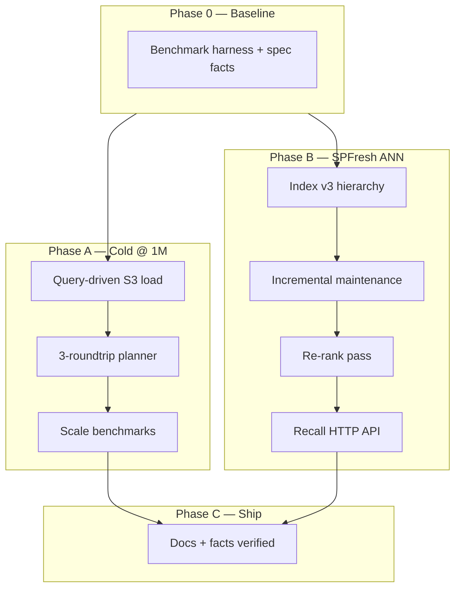

# Plan: SPFresh ANN and cold query @ 1M documents

This document is the implementation and testing plan for closing the two largest architecture gaps versus [TurboPuffer](https://turbopuffer.com/docs/architecture): **production-grade centroid ANN (SPFresh)** and **cold-query latency at million-document scale**.

Related docs:

- [ARCHITECTURE.md](ARCHITECTURE.md) — current on-disk layout and query phases
- [COMPARISON.md](COMPARISON.md) — honest maturity vs TurboPuffer

Work follows fact-driven development: add `@spec` facts in `.facts` before each phase, implement, then `facts check --tags <tag>` and tag `@implemented`.

---

## Program-level targets (v0.3)

| Goal | Target | TurboPuffer reference |
|------|--------|------------------------|
| **ANN recall** | `recall@10 ≥ 0.90` on 100k-doc synthetic; `≥ 0.85` on 1M | [Recall API](https://turbopuffer.com/docs/recall) |
| **Cold query @ 1M** | `storage_roundtrips ≤ 4`, p50 **< 600ms** on AWS S3 (128-dim f32, vector-only, fully indexed, no WAL tail) | ~400–500ms class @ 1M |
| **Cold fetch scope** | S3 GET count scales with **probe plan**, not `num_fine_total` | Planner-driven fetches |
| **Index @ 1M** | `index_cursor == wal_commit_seq` after ingest; index object count bounded by v3 layout | Dedicated indexer fleet |

**Non-goals:** multi-region control plane, API auth, full TurboPuffer API parity, HNSW / graph indexes.

---

## Current state

### Why 1M documents is hard today

With `MAX_COARSE_CENTROIDS = 16` and ~1M docs:

- ~62k docs per coarse cell → `num_fine ≈ 250` per cell → **`num_fine_total ≈ 4,000`** cluster objects on S3.
- Cold load uses `fetch_cold_index_artifacts` → `round2_keys` → **all** L1 and cluster keys in one parallel batch.
- Cached load in `indexer.rs` loops `fine_id in 0..l0.num_fine_total` — the same full-index behavior.

### Probe planner exists but is not on the query hot path

`src/s3_batch.rs` defines `round2_keys_for_query` and `round2_keys_for_query_probe` for probed keys. Production paths still call `fetch_cold_index_artifacts` and load every cluster file.

### ANN and tests today

- Two-level k-means++; unit test `recall@10 > 0.75` on 1k × 32-dim.
- Perf: 5k in-memory `candidates_ratio < 0.12`; MinIO 10k/50k integration; no 100k/1M cold gates or HTTP recall.

---

## Architecture overview

**Order:** Phase 0 → A (query-driven cold load before or in parallel with B1) → B → C.

---

## Phase 0 — Baseline, facts, harness

Establish measurable baselines and spec facts so later phases have automated proof.

### Work

- Add `@spec` facts under `index/ann` and `query/cold` (see outcomes below).
- Introduce `bench` feature: `tests/bench_cold.rs`, `scripts/bench-1m.sh`, `docs/BENCHMARKS.md`.
- Optional metrics: `openpuffer_cold_s3_keys_fetched`, `openpuffer_ann_probed_clusters`, cold-query latency histogram.

### Testable outcome

Phase 0 is **done** when all of the following hold:

1. **Baseline artifact exists:** a committed or CI-generated report (e.g. `benchmarks/results/baseline-10k.json`) recording for an indexed 10k namespace with `--cache-dir=""`: `storage_roundtrips`, S3 GET count (or `openpuffer_cold_s3_keys_fetched`), p50 query latency, `candidates_ratio`, and `index/` object count.
2. **Spec facts are checkable:** at least these `@spec` facts exist in `.facts` with `command:` or clear manual checks:
   - probed-only cluster fetch (cold vector query),
   - `storage_roundtrips ≤ 4` (strong, caught-up namespace),
   - `recall@10` threshold on 100k synthetic,
   - recall HTTP response shape (if scoped in this program),
   - `ann_version` / v3 index (if scoped in this program).
3. **`cargo test -F bench`** (or documented equivalent) runs without `#[ignore]` on 10k and prints the same fields as (1) so regressions are diffable.
4. **`facts check --tags cold,ann`** runs against spec facts (expect fail until later phases; facts must be present and valid).

---

## Phase A — Cold @ 1M

Make cold queries fetch only what the probe plan needs, bound logical S3 roundtrips, and prove behavior at 10k (CI), 100k (nightly), and 1M (manual/AWS).

### A1 — Query-driven index load

**Problem:** `Storage::loaded_from_view` materializes the full vector index via `fetch_cold_index_artifacts` before scoring.

**Design:**

- Partial load: L0 at bootstrap; L1 + `clusters-*` only for probed ids per query.
- Cold namespace open: meta + WAL; cluster GETs on query path.
- Keep full-index load for warm prefetch / export only.

**Primary files:** `src/s3_batch.rs`, `src/storage.rs`, `src/search.rs`, `src/indexer.rs`, new loader module.

### A2 — Three-roundtrip cold planner

| Roundtrip | Objects |
|-----------|---------|
| 1 | `meta.json` (+ WAL snapshot/tail when `consistency: strong`) |
| 2 | L0 + FTS + filter |
| 3 | Probed L1 + probed clusters (+ optional unindexed WAL batch) |

Sub-batches inside a round still count as one `storage_roundtrip`.

### A3 — Scale benchmarks

| Tier | Namespace size | Environment |
|------|----------------|-------------|
| CI | 10k | MinIO testcontainers |
| Nightly | 100k | MinIO, `#[ignore]` or dedicated job |
| Manual | 1M | AWS S3 (MinIO for correctness only, not latency SLO) |

### Testable outcome

Phase A is **done** when all of the following hold:

1. **Probed fetch only:** on a 10k indexed namespace, `serve` with `--cache-dir=""`, vector `rank_by` query — counted S3 GETs for cluster keys ≤ `probe_coarse + probe_coarse × probe_fine + 4` (integration test or metrics); GET count does **not** scale with `num_fine_total` when `num_fine_total > 100`.
2. **Planner unit test:** synthetic `CentroidIndexL0` with `num_fine_total = 4000` — `plan_cold_query` / round-3 key list length is between 8 and 64, not 4000.
3. **Roundtrips:** same 10k test — `performance.storage_roundtrips ≤ 4` with `consistency: strong` and `index_cursor == wal_commit_seq`.
4. **Correctness:** existing integration tests (`s3_cold_query_reports_roundtrips_on_minio`, 10k ANN query, compaction + cold restart) pass unchanged functionally (top-1 id or recall@10 on fixed fixture).
5. **100k nightly:** indexed namespace, `recall@10 ≥ 0.88` (lib or HTTP), `candidates_ratio < 0.20`.
6. **1M manual (AWS):** documented run in `docs/BENCHMARKS.md` — fully indexed 1M × 128-dim, cold vector query: `storage_roundtrips ≤ 4`, `recall@10 ≥ 0.85`, p50 latency **< 600ms** recorded in `benchmarks/results/1m-aws.json`.
7. **Facts:** probed-fetch and roundtrip spec facts tagged `@implemented`; `facts check --tags cold` passes.

---

## Phase B — SPFresh ANN

Improve recall and index shape so probe plans stay small at 1M documents.

### B1 — Index format v3

- `ann_version` on `CentroidIndexL0` (v2 default; dual-read).
- Scalable `num_coarse`; optional L2 splits; optional `centroids-routing.bin`.
- Writer gated by `OPENPUFFER_ANN_VERSION=3`.

### B2 — Incremental maintenance

Split/merge/reassign clusters; scheduled full rebuild — not only `doc_count > 4 × num_fine_total`.

### B3 — Re-rank pass

ANN pool → exact distance on view vectors → final `top_k`.

### B4 — Recall API

`POST /v1/namespaces/{name}/recall` + `measure_recall()` for benches.

### Testable outcome

Phase B is **done** when all of the following hold:

1. **v3 roundtrip:** `cargo test` encodes/decodes v3 L0/L1/cluster segments; v2 segments still load.
2. **Object count @ 100k:** after full index on 100k × 128-dim v3 namespace, `ListObjects` under `index/{field}/` cluster + L1 key count **< 500** (exact cap encoded in spec fact).
3. **Recall vs v2:** on identical 10k synthetic fixture, v3 `recall@10` ≥ v2 `recall@10` + 0.05 (same probes).
4. **100k recall:** `recall@10 ≥ 0.90` on 100k synthetic (unit or bench).
5. **Maintenance:** 20k docs in four 5k waves without forced full rebuild — no cluster has **> 512** members; `recall@10` never drops below **0.80** across waves (integration or bench).
6. **Re-rank:** with re-rank enabled on 10k fixture, `recall@10 ≥ 0.92`; documented that `candidates_ratio` may increase vs probe-only.
7. **Recall HTTP:** `POST …/recall` with `num=5`, `top_k=10` returns JSON containing numeric `avg_recall`, `avg_ann_count`, `avg_exhaustive_count`; integration test on MinIO namespace with `avg_recall ≥ 0.85`.
8. **1M recall (manual/AWS):** `recall@10 ≥ 0.85` on fully indexed 1M namespace (bench script or recall endpoint).
9. **Facts:** `ann_version` and recall-threshold spec facts tagged `@implemented`; `facts check --tags ann` passes.

---

## Phase C — Integration and release

Align docs and fact sheet with shipped behavior.

### Work

- Update [ARCHITECTURE.md](ARCHITECTURE.md) and [COMPARISON.md](COMPARISON.md) for cold planner and v3 ANN.
- [CHANGELOG.md](../CHANGELOG.md) for user-visible changes.
- Crate version bump if default on-disk format changes.

### Testable outcome

Phase C is **done** when all of the following hold:

1. **ARCHITECTURE.md** describes query-driven cold load, three-roundtrip plan, and v3 index layout (no longer “fetch all clusters on cold load”).
2. **COMPARISON.md** cold @ 1M and SPFresh rows match measured results from Phase A/B benchmark artifacts (or state “validated on AWS” with file path).
3. **`facts check --tags "ann or cold"`** exits 0 with all matching spec facts `@implemented`.
4. **Default CI** (`cargo test -F integration`) includes Phase A 10k gates; no regression in `perf` 5k `candidates_ratio < 0.12`.

---

## Verification map

| Phase | Primary commands / tests |
|-------|---------------------------|
| 0 | `cargo test -F bench`, `facts check --tags cold,ann` |
| A | `cargo test -F integration` (cold GET + roundtrips), `bench` 10k/100k, manual `scripts/bench-1m.sh` |
| B | `cargo test --lib recall_*`, integration recall HTTP, v3 segment tests, 100k bench |
| C | `facts check --tags "ann or cold"`, doc review, full integration + `cargo test -F perf` |

---

## Risks and mitigations

| Risk | Mitigation |
|------|------------|
| Breaking on-disk index | `ann_version` in L0; dual-read v2/v3 |
| Huge parallel GET batches | Sub-batches per round; per-round key cap |
| 1M ingest under WAL rate limit | Document commit cadence; use `upsert_columns` 10k rows/commit |
| MinIO vs AWS latency | Correctness gates on MinIO; p50 SLO verified on AWS only |
| Recall vs latency | Re-rank optional; probes configurable via env |

---

## References

- [TurboPuffer Architecture](https://turbopuffer.com/docs/architecture)
- [TurboPuffer Performance](https://turbopuffer.com/docs/performance)
- [TurboPuffer Recall](https://turbopuffer.com/docs/recall)
- [SPFresh (ACM)](https://dl.acm.org/doi/10.1145/3600006.3613166)
- openpuffer: `src/index/vector.rs`, `src/s3_batch.rs`, `tests/perf_namespace.rs`, `tests/stress_50k.rs`