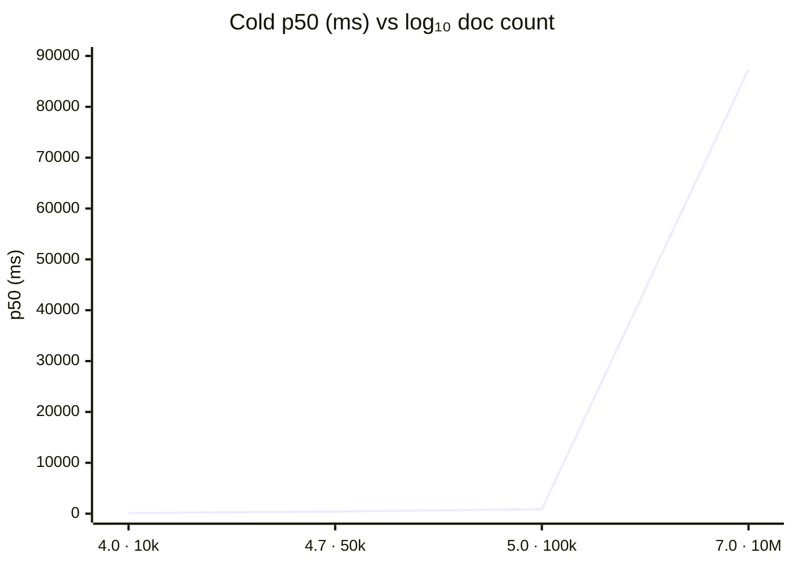
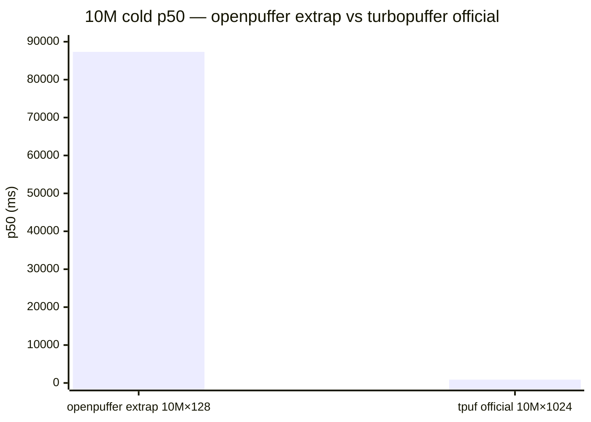
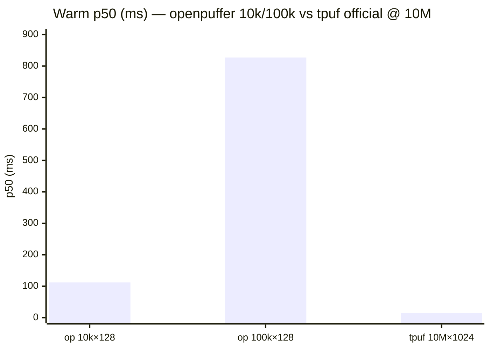

# openpuffer vs turbopuffer — scaling comparison report

**Date:** 2026-06-05 (UTC)  
**Scope:** Document-count scaling **shape** on MinIO vs turbopuffer’s **official** 10M × 1024 cold reference—not a live head-to-head at 10M.  
**Related:** [OPENS_VS_TPUF_SCALING_COMPARISON.md](OPENS_VS_TPUF_SCALING_COMPARISON.md) (iteration log), [COMPARISON.md](../COMPARISON.md) § scaling.

---

> ### ⚠️ Critical insight — same latency, different scale (NOT comparable)
>
> At **100k × 128** on MinIO, openpuffer measured cold **p50 ≈ 880 ms** is almost exactly turbopuffer’s official **874 ms** at **10M × 1024** on GCP—**same order of magnitude**, but **not** an apples-to-apples comparison: **100×** fewer documents, **8×** fewer dimensions, self-hosted MinIO vs managed fleet, and a different load model (7 sequential probes vs **8 QPS × 30 min**).
>
> **If** cold p50 scaled linearly with doc count on this harness, **10M × 128** extrapolates to **~87 s** (~**100×** tpuf **874 ms**)—openpuffer does **not** scale like turbopuffer’s published fleet curve. **Alternative reading:** tpuf’s **874 ms** may reflect fleet optimizations (NVMe/cache hierarchy, SPFresh at 10M) absent in self-hosted MinIO at **100k**.

---

## Executive summary

- **turbopuffer (official):** cold p50 **874 ms** at **10M × 1024** on GCP (`c2-standard-30`, 8 QPS × 30m, cache disabled) — [`tpuf-official-reference.json`](../../benchmarks/results/tpuf-official-reference.json). **Single published doc-count point** for cold; extrapolation uncertainty dominates any ratio vs 874 ms.
- **openpuffer (measured, MinIO):** cold p50 **96 / 412 / 880 ms** at **10k / 50k / 100k × 128**; synthetic-128 @ 10k: **97 ms** — [`op-scaling-*.json`](../../benchmarks/results/op-scaling-10k.json).
- **openpuffer (extrapolated to 10M, canonical linear):** **~87 s** p50 @ 10M×128 (**~100×** tpuf **874 ms** on doc count alone); √dim heuristic → **~247 s** (**~283×**); linear-d estimate → **~699 s** (**~799×**). **Not** validated on AWS or 1024-d. Back-solve **~100k docs** for 874 ms (linear).
- **Superseded conclusions (do not cite):** log_linear on **111/525/813** tiers → **~2.2 s** @ 10M (~**2.5×** tpuf); older linear on **86/400/824** → **~81 s** (~**93×**); anecdotal **~7 s** @ 100k—not in committed JSON.

**One-sentence answer:** **100k p50 ~880 ms ≈ tpuf 874 ms @ 10M is not comparable**; measured tiers **96 / 412 / 880 ms** grow with doc count (β ≈ 0.95); **linear** extrapolation → **~87 s** @ **10M × 128** (~**100×** tpuf)—**not** parity on AWS/1024-d/10M; warm **827 ms** @ 100k (~**59×** tpuf **14 ms**); 100k ingest **132 s** @ **758 docs/s** (WAL+index wall).

**Operator verdict:** [`scaling-comparison-summary.json`](../../benchmarks/results/scaling-comparison-summary.json) · `./scripts/print-scaling-verdict.sh`

---

## Confidence

| Claim | Confidence | Why |
|-------|------------|-----|
| 100k×128 p50 ~880 ms ≈ tpuf 874 ms @ 10M×1024 (order of magnitude) | **High** (numbers) / **N/A** (parity) | Committed JSON; **not** comparable workloads |
| Measured cold p50 @ 10k–100k × 128 (MinIO) | **High** | Committed `op-scaling-*.json`; release+v3; CI schema gate |
| 100k sub-linear vs 10k+50k bridge | **Medium** | LOO + bounded `index_object_count`; see § 100k stability |
| Extrapolated 10M × 128 (~87 s, ~100× tpuf) | **Low** | Unmeasured; model choice (linear best R² on 96/412/880) |
| √dim / linear-d @ 10M × 1024 (~283× / ~799×) | **Low** | Heuristics; 128-d synthetic only on openpuffer |
| turbopuffer doc-count scaling shape | **Low** | Single official cold point at 10M |
| Head-to-head parity @ 10M | **None** here | MinIO vs GCP; different QPS model |

---

## Methodology

| Aspect | turbopuffer (official reference) | openpuffer (this report) |
|--------|----------------------------------|---------------------------|
| **Source** | [turbopuffer.com](https://turbopuffer.com) calculator + [tpuf-benchmark](https://github.com/turbopuffer/tpuf-benchmark) | Committed `op-scaling-*.json` from `scripts/run-op-scaling-benchmark.sh` |
| **Scale** | **10M × 1024** (Cohere Wikipedia embeddings) | **10k / 50k / 100k × 128** (synthetic `bench_sin_v1`) |
| **Environment** | Managed GCP (`c2-standard-30`, `gcp-us-central1`) | MinIO testcontainers (`minio-testcontainers`) |
| **Cold path** | `disable_cache: true` ([`vector-10m-cold.toml`](../../benchmarks/specs/tpuf/vector-10m-cold.toml)) | `serve --cache-dir ""`, strong consistency, 7 sequential cold samples |
| **Warm path** | `warm_cache=true`, 100% cache hit before load | `POST …/warm` + eventual ([`op-scaling-10k-warm.json`](../../benchmarks/results/op-scaling-10k-warm.json)) |
| **Load model** | **8 QPS × 30 min**, 1 namespace | Single-client sequential (not 8 QPS sustained) |
| **Query** | Vector ANN, `top_k=10`, cosine | Same protocol shape (`top_k=10`, ANN v3) |
| **Build** | Managed service | `cargo --release`, `OPENPUFFER_ANN_VERSION=3` |
| **Artifact** | [`tpuf-official-reference.json`](../../benchmarks/results/tpuf-official-reference.json) | [`op-scaling-10k.json`](../../benchmarks/results/op-scaling-10k.json), [`50k`](../../benchmarks/results/op-scaling-50k.json), [`100k`](../../benchmarks/results/op-scaling-100k.json), [`10k-synthetic128`](../../benchmarks/results/op-scaling-10k-synthetic128.json) |
| **Extrapolation** | N/A (single published N) | [`compare_op_scaling_to_tpuf.py`](../../benchmarks/report/compare_op_scaling_to_tpuf.py) via `make bench-compare-tpuf` |

---

## Measured data (cold p50, ms)

| Docs | Dims | Label | p50 | p90 | p99 | Environment |
|------|------|-------|-----|-----|-----|-------------|
| 10,000 | 128 | 10k (inline stress) | **96** | 99 | 99 | minio-testcontainers |
| 10,000 | 128 | 10k-synthetic128 (`queries.json`) | **97** | 108 | 108 | minio-testcontainers |
| 50,000 | 128 | 50k | **412** | 450 | 450 | minio-testcontainers |
| 100,000 | 128 | 100k | **880** | 900 | 900 | minio-testcontainers |

**Ingest (from `op-scaling-*.json`, same runs):** 10k **11 s** @ **909 docs/s**; 50k **14 s** @ **3571 docs/s**; 100k **132 s** @ **758 docs/s**.

**Warm @ 10k / 100k:** p50 **112 / 827 ms** ([`op-scaling-10k-warm.json`](../../benchmarks/results/op-scaling-10k-warm.json), [`op-scaling-100k-warm.json`](../../benchmarks/results/op-scaling-100k-warm.json)) vs tpuf **14 ms** @ 10M ([`tpuf-official-reference.json`](../../benchmarks/results/tpuf-official-reference.json)) — **~59×** @ 100k (not comparable scale/backend).

**Scaling read (10k → 100k):** **~9.2×** latency for **10×** docs → power-law **β ≈ 0.95**; per-doc p50 **~0.0088 ms/doc** at 100k.

### Same latency, different scale

| Row | openpuffer (measured) | turbopuffer (official) | Comparable? |
|-----|------------------------|-------------------------|-------------|
| **Same latency, different scale** | **~880 ms** cold p50 @ **100k × 128** MinIO | **874 ms** cold p50 @ **10M × 1024** GCP | **No** — **100×** docs, **8×** dims, different backend & load |
| Doc count | 100,000 | 10,000,000 | — |
| Dimensions | 128 (synthetic) | 1024 (Cohere Wikipedia) | — |
| Environment | `minio-testcontainers` | `c2-standard-30`, `gcp-us-central1` | — |
| Load model | 7 sequential cold probes | **8 QPS × 30 min** | — |
| Linear extrap @ 10M×128 (if β holds) | **~87 s** (~**100×** tpuf) | **874 ms** (measured @ 10M) | Extrap only; unmeasured on openpuffer |

**Takeaway:** Matching **~880 ms** vs **874 ms** does **not** imply openpuffer is “as fast as tpuf at 10M”; it highlights that **per-doc cold work** on MinIO at **100k** is already in the same **millisecond band** as tpuf’s **10M** marketing number—while **doc-count extrapolation** diverges sharply (~**100×** at 10M if linear).

---

## Visual summary (doc count vs cold p50)

X-axis uses **log₁₀(document count)** so 10k / 50k / 100k / 10M are evenly spaced; Y is cold **p50 (ms)**. openpuffer **10M** point is **linear extrapolation** (unmeasured). turbopuffer has **one** official cold point @ 10M ([`tpuf-official-reference.json`](../../benchmarks/results/tpuf-official-reference.json)).

### Mermaid — scaling curve (log₁₀ N)



### Mermaid — @ 10M only (extrap vs official)



### Mermaid — warm path (measured openpuffer vs tpuf @ 10M)



### ASCII (terminal / plain-text)

```
Cold p50 (ms) vs document count — log₁₀(N) on horizontal axis
(● measured openpuffer  ○ extrap  ■ turbopuffer official @ 10M only)

p50
(ms)
87321 ┤                                                      ○ op extrap (linear)
 1000 ┤                                              ■ tpuf 874
  880 ┤                                    ● op 880
  500 ┤
  412 ┤                       ● op 412
  200 ┤
   96 ┤          ● op 96
    0 ┼──────────┬──────────┬──────────┬──────────────────────
      log₁₀(N)=4.0      4.7       5.0                    7.0
           10k        50k      100k                    10M

Legend: ● 96 / 412 / 880 ms (MinIO, 128-d, committed JSON @ 7f7c0f5)
        ○ 87321 ms = linear extrap @ 10M×128 (~100× tpuf on doc count alone)
        ■ 874 ms = turbopuffer homepage calculator (10M×1024, GCP, 8 QPS×30m)
```

**Operator one-liner:** `./scripts/print-scaling-verdict.sh` (paragraph verdict from committed JSON).

---

### 100k tier stability (2026-06-05)

Three `run-op-scaling-benchmark.sh 100k` runs (release, same harness):

| Run | p50 (ms) |
|-----|----------|
| Prior sweep (`da45441`, superseded) | **813** |
| Stability rerun 1 | **857** |
| Stability rerun 2 | **906** |
| Refresh @ `7f7c0f5` (committed) | **880** |

**Variance (four runs):** min **813**, max **906**, median **869**, σ≈**38 ms** (~±4% vs median). Jitter is host/MinIO noise and per-run ingest layout, not the superseded ~7 s outlier. Committed JSON uses refresh **880 ms** (p90/p99 **900**).

**Index objects (bench harness, not in `op-scaling-*.json`):** `index_object_count` **280** @ 100k on `7f7c0f5` refresh (prior sweep **269** @ 100k; 10k/50k unchanged class).

---

## Efficiency metrics

Beyond cold **p50**, this section compares **cold-path probe efficiency** (S3 roundtrips, candidate fraction, recall) and **order-of-magnitude ingest** claims. turbopuffer rows below are **published policy/docs**, not re-measured in this repo.

### turbopuffer — official throughput and latency claims

Sources: [Tradeoffs](https://turbopuffer.com/docs/tradeoffs) (2026-06-05), [tpuf-official-reference.json](../../benchmarks/results/tpuf-official-reference.json), vendored [`vector-10m-cold.toml`](../../benchmarks/specs/tpuf/vector-10m-cold.toml).

| Topic | Claim | Notes |
|-------|--------|-------|
| **Consistent read floor** | **~10 ms** | Object-storage metadata checks for latest writes; sub-10 ms needs `consistency: eventual` |
| **Warm query class** | **~14 ms p50** @ 10M × 1024 | Homepage calculator / hot spec (NVMe + cache) |
| **Cold tail** | **P99 in 100s of ms** occasionally | Cold queries on object storage; marketing cold p50 **874 ms** @ 10M |
| **Write commit** | **Up to ~200 ms** to durable commit | WAL-on-object-storage; **thousands of writes/s per namespace** |
| **Query bench load** | **8 QPS × 30 min**, 1 namespace | `vectors_10m_cold`; not single-client sequential |

openpuffer does **not** expose `storage_roundtrips` / `candidates_ratio` on the turbopuffer API; those are openpuffer-only cold-path metrics.

### openpuffer — cold-path efficiency by tier

`op-scaling-*.json` records `storage_roundtrips` and `recall_at_10` where the harness emits them. **`candidates_ratio`** comes from companion bench artifacts ([`baseline-10k.json`](../../benchmarks/results/baseline-10k.json), [`cold-50k-v3.json`](../../benchmarks/results/cold-50k-v3.json), [`nightly-100k.json`](../../benchmarks/results/nightly-100k.json)) on the **same** MinIO + v3 probed cold path (inline 10k/50k/100k vectors except **synthetic-128 @ 10k**).

| Tier | Docs × dims | `storage_roundtrips` | `candidates_ratio` | `recall_at_10` | Cold p50 (op-scaling) | Artifact |
|------|-------------|----------------------|--------------------|----------------|------------------------|----------|
| 10k | 10k × 128 | **3** | **0.008** | — (not in op-scaling) | **96 ms** | [`op-scaling-10k.json`](../../benchmarks/results/op-scaling-10k.json) + [`baseline-10k.json`](../../benchmarks/results/baseline-10k.json) |
| 10k synthetic-128 | 10k × 128 | **3** | _(same gate; ratio not in op-scaling JSON)_ | **1.0** | **97 ms** | [`op-scaling-10k-synthetic128.json`](../../benchmarks/results/op-scaling-10k-synthetic128.json) |
| 50k | 50k × 128 | **3** | **0.0016** | **1.0** | **412 ms** | [`op-scaling-50k.json`](../../benchmarks/results/op-scaling-50k.json) + [`cold-50k-v3.json`](../../benchmarks/results/cold-50k-v3.json) |
| 100k | 100k × 128 | **3** | **0.0008** | **1.0** | **880 ms** | [`op-scaling-100k.json`](../../benchmarks/results/op-scaling-100k.json) + [`nightly-100k.json`](../../benchmarks/results/nightly-100k.json) |

**Read:** `storage_roundtrips` stays **3** (≤ 4 gate) across tiers—cold probe work scales in **latency**, not extra S3 batch rounds on this sweep. `candidates_ratio` falls **0.008 → 0.0016 → 0.0008** as N grows (sub-linear candidate fraction). `recall_at_10` is **1.0** @ 50k/100k on measured gates.

**Warm path (MinIO, `POST /warm` + 7× eventual):**

| Tier | Docs × dims | openpuffer warm p50 | tpuf warm p50 (official) | Ratio vs tpuf 14 ms |
|------|-------------|---------------------|--------------------------|---------------------|
| 10k | 10k × 128 | **112 ms** | **14 ms** @ **10M × 1024** | **~8×** (100× fewer docs, 8× fewer dims) |
| 100k | 100k × 128 | **827 ms** | same | **~59×** |

Artifacts: [`op-scaling-10k-warm.json`](../../benchmarks/results/op-scaling-10k-warm.json), [`op-scaling-100k-warm.json`](../../benchmarks/results/op-scaling-100k-warm.json). Harness: `bench_cold_100k_warm` via `./scripts/run-op-scaling-benchmark.sh 100k-warm` (~**2.5 min** ingest+index + warm on this host @ `ff47227`). **Not** tpuf `hint_cache_warm` @ fleet NVMe; MinIO loopback + full-index warm prefetch (`warm.rs` walks `num_fine_total` cluster keys).

**Corroboration (different harness):** [`large-aws-l1-schema-minio.example.json`](../../benchmarks/results/large-aws-l1-schema-minio.example.json) `bench-large.sh --warm` @ 100k reports warm p50 **860 ms** — same order of magnitude as **827 ms** above.

**Takeaway:** Even with disk cache pinned, openpuffer warm @ **100k** stays **hundreds of ms** on MinIO—orders of magnitude above turbopuffer’s marketing **14 ms** @ **10M** (different N, D, and cache tier). Warm latency grows **~7.4×** from 10k→100k (**112 → 827 ms**) for **10×** docs (β ≈ 0.87), unlike a flat warm floor.

### Ingest throughput (order-of-magnitude, not apples-to-apples)

| System | What is measured | Order-of-magnitude |
|--------|------------------|--------------------|
| **turbopuffer** | Write path: durable commit ≤ **~200 ms**; fleet **~10k+ vectors/s** class cited in product docs | Managed batching inside commit window; **not** ~1 HTTP commit/s cap |
| **openpuffer @ 100k nightly** | `bench_cold_100k_nightly`: upsert + index until caught-up, then 7 cold queries | [`op-scaling-100k.json`](../../benchmarks/results/op-scaling-100k.json): **`ingest_wall_secs`: 132** → **758 docs/s** end-to-end @ `7f7c0f5` (~2.7 min wall on this host) |
| **openpuffer @ 50k (inline stress)** | `fifty_thousand_docs_v3_cold_probed_validation` | [`op-scaling-50k.json`](../../benchmarks/results/op-scaling-50k.json): **`ingest_wall_secs`: 14** → **3571 docs/s** (5×10k batches; **not** synthetic-128 workload) |
| **openpuffer @ 10k** | `bench_cold_10k_baseline` | [`op-scaling-10k.json`](../../benchmarks/results/op-scaling-10k.json): **`ingest_wall_secs`: 11** → **909 docs/s** |

**Caveats:** openpuffer enforces **~1 WAL commit/s per namespace** ([`COMPARISON.md`](../COMPARISON.md)); tpuf’s **200 ms commit** is a **latency bound**, not the same throughput model. Do **not** equate openpuffer end-to-end MinIO ingest+index minutes with tpuf write-path seconds.

### synthetic-128 cold @ 50k — skipped

**Not run** in this iteration. Existing gates: [`bench_cold_10k_synthetic_128_workload_gate`](../../tests/bench_cold.rs) @ 10k only; 50k uses [`stress_50k`](../../tests/stress_50k.rs) **inline** embeddings (not `queries.json`). A 50k synthetic-128 gate would require a new test (ingest+index **≫30 min** on this host per 100k nightly class) — deferred.

---

**Official turbopuffer reference (not re-measured here):**

| Path | Docs × dims | p50 | p90 | p99 |
|------|-------------|-----|-----|-----|
| Cold | 10M × 1024 | **874** | 1214 | 1686 |
| Warm | 10M × 1024 | **14** | 17 | 27 |

---

## Scaling tail (100k vs 10k+50k linear bridge)

Leave-one-out on a **linear** fit (collapsed tiers) predicts **~770 ms** @ 100k; measured **880 ms** (+14%). A two-point bridge 10k→50k alone predicts **~824 ms** @ 100k. **No super-linear cold tail** on this refresh—100k is modestly **above** the LOO linear prediction. `index_object_count` @ 100k **280** (bench harness) remains bounded (&lt; 500 cap).

---

## Extrapolation and back-solve

**Fit (4 labels, collapsed @ 10k → 96.5 ms mean):** best model **linear**  
\(L \approx -2.89 + 0.00873\cdot N\) with **R² = 0.998**.

| Scale | openpuffer p50 (extrap / estimate) | vs tpuf cold **874 ms** |
|-------|--------------------------------------|-------------------------|
| 1M × 128 | **8,729 ms** (~8.7 s) | ~10× |
| 10M × 128 | **87,321 ms** (~87 s) | **~100×** |
| 10M × 1024 (√dim heuristic, ×2.83) | **246,981 ms** (~247 s) | **~283×** |
| 10M × 1024 (linear-d estimate, ×8) | **698,567 ms** (~699 s) | **~799×** |
| turbopuffer official | **874 ms** | 1× |

**When would openpuffer match tpuf 874 ms?** (same MinIO harness, 128-d, cold p50—extrapolation only)

| Model | N @ 874 ms |
|-------|------------|
| power-law | **~104k** (103,705) |
| linear (best) | **~100k** (100,419) |
| log-linear | **~136k** (135,972) |

**Per-doc @ 10M (cold p50 / N):** openpuffer extrap **~8732 µs/doc** vs tpuf official **~87 µs/doc** → need **~100×** lower per-doc cold work on this normalization (extrapolation only; not a competitiveness claim).

**Similar scaling?** **Shape:** near-linear / power β≈0.95 on measured tiers; **absolute:** linear extrapolation to 10M MinIO cold is **~100×** above tpuf’s GCP managed number on doc count alone; do not treat linear extrapolation to 10M as measured.

---

## Limitations

1. **MinIO vs managed S3/GCP** — loopback object storage; no cross-region WAN, no turbopuffer fleet NVMe warm tier.
2. **128-d synthetic vs 1024-d real embeddings** — different probe cost and index geometry; √dim and linear-d rows are **heuristics**, not measurements.
3. **Self-hosted single `serve` vs managed multi-tenant fleet** — no tpuf query-node cache hierarchy or production SPFresh at 10M.
4. **Load model** — 7 sequential cold samples, not **8 QPS × 30 min**; tail latency and queueing differ.
5. **Doc-count curve for tpuf** — only **one** official cold point at 10M; cannot fit β for turbopuffer from public data.
6. **500k tier skipped** — MinIO L2 ingest + index ≫ 45 min on dev host; not in fit set.
7. **Extrapolation to 10M** — unmeasured; **canonical linear** fixed in compare script (~**87 s** @ 10M×128 on 96/412/880). Prior auto best-by-R² swung **~2 s** (log_linear on 111/525/813) vs **~87 s**—use `EXTRAP_JSON.canonical_model` only for headlines.
8. **turbopuffer official** — **one** cold point @ 10M; extrapolation uncertainty dominates any ratio vs **874 ms**.
9. **100k rerun variance** — ±6% p50 across three runs; not instability at 10× level.

---

## What would be needed for a fair test

| Requirement | Why |
|-------------|-----|
| **AWS S3** (or same region as client) for openpuffer | Match object-storage latency class, not MinIO loopback |
| **`TURBOPUFFER_API_KEY`** (test org) | Run live tpuf at matched tiers via `run-tpuf-large-benchmark.sh` / G4; optional minimal 10k probe → `benchmarks/results/tpuf-scaling-10k-live.json` (**blocked 2026-06-05:** key unset in operator env) |
| **EC2 in target region** | Same-region client as S3 and tpuf (`aws-us-east-1` or plan region) |
| **Matched workload** | Same `queries.json` / seed / `top_k` / distance; align doc counts where affordable (100k–1M L1/L2 first) |
| **Matched dimensions** | Prefer 128-d on both sides for L1; 1024-d only if budget allows full embedding ingest |
| **Matched load** | Sustained QPS and duration per tpuf spec, or document divergence |
| **G5 measured report** | `render-report.sh` without `--dry-run`; update [COMPARISON.md](../COMPARISON.md) measured rows |

Until then, treat this report as **MinIO scaling shape + official tpuf reference**, not head-to-head at 10M.

---

## Commands to reproduce

**Five-command quickstart:** [`benchmarks/SCALING_VS_TPUF_QUICKSTART.md`](../../benchmarks/SCALING_VS_TPUF_QUICKSTART.md).

```bash
# Regenerate op-scaling JSON (requires Docker for MinIO testcontainers; slow at 50k/100k)
make bench-op-scaling
# Or per tier:
./scripts/run-op-scaling-benchmark.sh 10k
./scripts/run-op-scaling-benchmark.sh 50k
./scripts/run-op-scaling-benchmark.sh 100k
./scripts/run-op-scaling-benchmark.sh warm
./scripts/run-op-scaling-benchmark.sh 100k-warm   # ~2.5 min ingest+index+warm

# Print extrapolation, models, back-solve (offline; uses committed JSON)
make bench-compare-tpuf
# Equivalent:
./scripts/compare-op-scaling-to-tpuf.sh

# CI gate (committed artifacts only)
./scripts/verify-op-scaling-comparison.sh

# One-paragraph operator verdict
./scripts/print-scaling-verdict.sh
```

**Key files:** `benchmarks/results/op-scaling-*.json`, `benchmarks/results/tpuf-official-reference.json`, `benchmarks/report/compare_op_scaling_to_tpuf.py`, `scripts/compare-op-scaling-to-tpuf.sh`.

---

## Appendix: `make bench-compare-tpuf` output

Captured after 100k refresh @ `7f7c0f5` (committed JSON):

```
Measured openpuffer cold p50: 10k=96ms, 50k=412ms, 100k=880ms
Canonical model: linear — extrap 10M×128 = 87321 ms (ratio_vs_tpuf ~100×, confidence: low)
Verdict: ./scripts/print-scaling-verdict.sh — ingest 10k=909 docs/s, 50k=3571, 100k=758
```

Full tables: run `make bench-compare-tpuf`. `EXTRAP_JSON` fields: `canonical_model`, `extrap_p50_10m_128_ms`, `ratio_vs_tpuf` (cold), `ratio_warm_10k_vs_tpuf`, `ratio_warm_100k_vs_tpuf`, `warm_ratios_vs_tpuf`, `tpuf_official_warm_p50_ms`, `confidence` (override: `--model=`). See `benchmarks/report/compare_op_scaling_to_tpuf.py`.