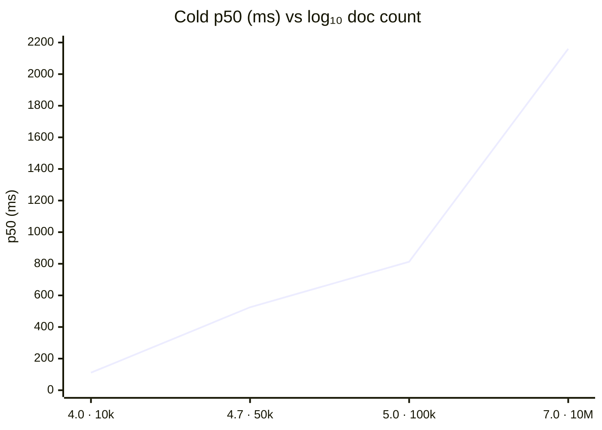
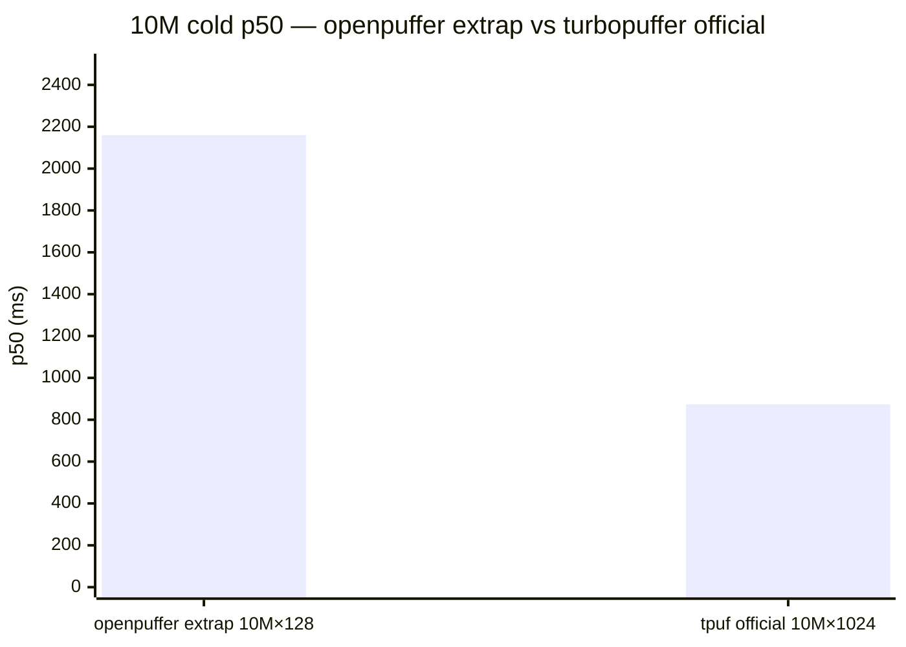

# openpuffer vs turbopuffer — scaling comparison report

**Date:** 2026-06-05 (UTC)  
**Scope:** Document-count scaling **shape** on MinIO vs turbopuffer’s **official** 10M × 1024 cold reference—not a live head-to-head at 10M.  
**Related:** [OPENS_VS_TPUF_SCALING_COMPARISON.md](OPENS_VS_TPUF_SCALING_COMPARISON.md) (iteration log), [COMPARISON.md](../COMPARISON.md) § scaling.

---

## Executive summary

**openpuffer cold p50 on MinIO is still slower than turbopuffer’s published 10M GCP number**, but a fresh **2026-06-05** tier sweep (git `da45441`) shows **sub-linear tail at 100k** (813 ms measured vs ~1054 ms from a 10k+50k linear hold-out) and a **log-linear** four-point fit extrapolates **~2.2 s** cold p50 @ **10M × 128** vs turbopuffer **874 ms** @ **10M × 1024** (~**2.5×** on doc count alone; **~7×** with √dim heuristic to 1024-d). That extrapolation is **illustrative**—only three doc-count tiers exist, 10k/50k moved **+29% / +31%** vs the prior committed run, and environment/dimensionality/fleet differ.

**One-sentence answer:** Measured tiers **111 / 525 / 813 ms** (10k / 50k / 100k) grow roughly with doc count (β ≈ 0.91); extrapolated 10M×128 is **~2.2 s** on this harness vs tpuf **874 ms** (~**2.5×**, not **~70×**)—still **not** parity on AWS/1024-d/10M measured terms, with **100k faster than a naive linear bridge from 10k+50k** (index objects 72 → 236 → 269; see § scaling tail).

**Superseded (do not cite):** linear-only fit on older **86/400/824 ms** tiers → **~81 s** @ 10M (~**93×** slower); anecdotal **~7 s** @ 100k from debug build or contention.

---

## Confidence

| Claim | Confidence | Why |
|-------|------------|-----|
| Measured cold p50 @ 10k–100k × 128 (MinIO) | **High** | Committed `op-scaling-*.json`; release+v3; CI schema gate |
| 100k sub-linear vs 10k+50k bridge | **Medium** | LOO + bounded `index_object_count`; see § 100k stability |
| Extrapolated 10M × 128 (~2.2 s, ~2.5× tpuf) | **Low** | Unmeasured; log_linear vs prior linear swings **~2 s** vs **~80 s** |
| √dim / linear-d @ 10M × 1024 (~7× / ~20×) | **Low** | Heuristics; 128-d synthetic only on openpuffer |
| turbopuffer doc-count scaling shape | **Low** | Single official cold point at 10M |
| Head-to-head parity @ 10M | **None** here | MinIO vs GCP; different QPS model |

---

## Methodology

| Aspect | turbopuffer (official reference) | openpuffer (this report) |
|--------|----------------------------------|---------------------------|
| **Source** | [turbopuffer.com](https://turbopuffer.com) calculator + [tpuf-benchmark](https://github.com/turbopuffer/tpuf-benchmark) | Committed `op-scaling-*.json` from `scripts/run-op-scaling-benchmark.sh` |
| **Scale** | **10M × 1024** (Cohere Wikipedia embeddings) | **10k / 50k / 100k × 128** (synthetic `bench_sin_v1`) |
| **Environment** | Managed GCP (`c2-standard-30`, `gcp-us-central1`) | MinIO testcontainers (`minio-testcontainers`) |
| **Cold path** | `disable_cache: true` ([`vector-10m-cold.toml`](../../benchmarks/specs/tpuf/vector-10m-cold.toml)) | `serve --cache-dir ""`, strong consistency, 7 sequential cold samples |
| **Warm path** | `warm_cache=true`, 100% cache hit before load | `POST …/warm` + eventual ([`op-scaling-10k-warm.json`](../../benchmarks/results/op-scaling-10k-warm.json)) |
| **Load model** | **8 QPS × 30 min**, 1 namespace | Single-client sequential (not 8 QPS sustained) |
| **Query** | Vector ANN, `top_k=10`, cosine | Same protocol shape (`top_k=10`, ANN v3) |
| **Build** | Managed service | `cargo --release`, `OPENPUFFER_ANN_VERSION=3` |
| **Artifact** | [`tpuf-official-reference.json`](../../benchmarks/results/tpuf-official-reference.json) | [`op-scaling-10k.json`](../../benchmarks/results/op-scaling-10k.json), [`50k`](../../benchmarks/results/op-scaling-50k.json), [`100k`](../../benchmarks/results/op-scaling-100k.json), [`10k-synthetic128`](../../benchmarks/results/op-scaling-10k-synthetic128.json) |
| **Extrapolation** | N/A (single published N) | [`compare_op_scaling_to_tpuf.py`](../../benchmarks/report/compare_op_scaling_to_tpuf.py) via `make bench-compare-tpuf` |

---

## Measured data (cold p50, ms)

| Docs | Dims | Label | p50 | p90 | p99 | Environment |
|------|------|-------|-----|-----|-----|-------------|
| 10,000 | 128 | 10k (inline stress) | **111** | 128 | 128 | minio-testcontainers |
| 10,000 | 128 | 10k-synthetic128 (`queries.json`) | **97** | 108 | 108 | minio-testcontainers |
| 50,000 | 128 | 50k | **525** | 595 | 595 | minio-testcontainers |
| 100,000 | 128 | 100k | **813** | 900 | 900 | minio-testcontainers |

**Warm @ 10k:** p50 **81 ms** ([`op-scaling-10k-warm.json`](../../benchmarks/results/op-scaling-10k-warm.json)).

**Scaling read (10k → 100k):** **~7.3×** latency for **10×** docs → power-law **β ≈ 0.91**; per-doc p50 **~0.008 ms/doc** at 100k.

---

## Visual summary (doc count vs cold p50)

X-axis uses **log₁₀(document count)** so 10k / 50k / 100k / 10M are evenly spaced; Y is cold **p50 (ms)**. openpuffer **10M** point is **log_linear extrapolation** (unmeasured). turbopuffer has **one** official cold point @ 10M ([`tpuf-official-reference.json`](../../benchmarks/results/tpuf-official-reference.json)).

### Mermaid — scaling curve (log₁₀ N)



### Mermaid — @ 10M only (extrap vs official)



### ASCII (terminal / plain-text)

```
Cold p50 (ms) vs document count — log₁₀(N) on horizontal axis
(● measured openpuffer  ○ extrap  ■ turbopuffer official @ 10M only)

p50
(ms)
 2200 ┤                                                      ○ op extrap 2160
 2000 ┤
 1800 ┤
 1600 ┤
 1400 ┤
 1200 ┤
 1000 ┤                                              ■ tpuf 874
  800 ┤                                    ● op 813
  600 ┤
  525 ┤                       ● op 525
  400 ┤
  200 ┤          ● op 111
    0 ┼──────────┬──────────┬──────────┬──────────────────────
      log₁₀(N)=4.0      4.7       5.0                    7.0
           10k        50k      100k                    10M

Legend: ● 111 / 525 / 813 ms (MinIO, 128-d, committed JSON @ da45441)
        ○ 2160 ms = log_linear extrap @ 10M×128 (~2.5× tpuf on doc count alone)
        ■ 874 ms = turbopuffer homepage calculator (10M×1024, GCP, 8 QPS×30m)
```

**Operator one-liner:** `./scripts/print-scaling-verdict.sh` (paragraph verdict from committed JSON).

---

### 100k tier stability (2026-06-05)

Three `run-op-scaling-benchmark.sh 100k` runs (release, same harness):

| Run | p50 (ms) |
|-----|----------|
| Tier sweep (`9c637d1`, committed) | **813** |
| Stability rerun 1 | **857** |
| Stability rerun 2 | **906** |

**Variance:** min **813**, max **906**, median **857**, σ≈**47 ms** (~±6% vs median). Jitter is host/MinIO noise and per-run ingest layout, not the superseded ~7 s outlier. Extrapolation uses committed sweep **813 ms**.

**Index objects (bench harness, not in `op-scaling-*.json`):** `index_object_count` **72 / 236 / 269** @ 10k / 50k / 100k on tier sweep (all &lt; 500 cap).

---

## Efficiency metrics

Beyond cold **p50**, this section compares **cold-path probe efficiency** (S3 roundtrips, candidate fraction, recall) and **order-of-magnitude ingest** claims. turbopuffer rows below are **published policy/docs**, not re-measured in this repo.

### turbopuffer — official throughput and latency claims

Sources: [Tradeoffs](https://turbopuffer.com/docs/tradeoffs) (2026-06-05), [tpuf-official-reference.json](../../benchmarks/results/tpuf-official-reference.json), vendored [`vector-10m-cold.toml`](../../benchmarks/specs/tpuf/vector-10m-cold.toml).

| Topic | Claim | Notes |
|-------|--------|-------|
| **Consistent read floor** | **~10 ms** | Object-storage metadata checks for latest writes; sub-10 ms needs `consistency: eventual` |
| **Warm query class** | **~14 ms p50** @ 10M × 1024 | Homepage calculator / hot spec (NVMe + cache) |
| **Cold tail** | **P99 in 100s of ms** occasionally | Cold queries on object storage; marketing cold p50 **874 ms** @ 10M |
| **Write commit** | **Up to ~200 ms** to durable commit | WAL-on-object-storage; **thousands of writes/s per namespace** |
| **Query bench load** | **8 QPS × 30 min**, 1 namespace | `vectors_10m_cold`; not single-client sequential |

openpuffer does **not** expose `storage_roundtrips` / `candidates_ratio` on the turbopuffer API; those are openpuffer-only cold-path metrics.

### openpuffer — cold-path efficiency by tier

`op-scaling-*.json` records `storage_roundtrips` and `recall_at_10` where the harness emits them. **`candidates_ratio`** comes from companion bench artifacts ([`baseline-10k.json`](../../benchmarks/results/baseline-10k.json), [`cold-50k-v3.json`](../../benchmarks/results/cold-50k-v3.json), [`nightly-100k.json`](../../benchmarks/results/nightly-100k.json)) on the **same** MinIO + v3 probed cold path (inline 10k/50k/100k vectors except **synthetic-128 @ 10k**).

| Tier | Docs × dims | `storage_roundtrips` | `candidates_ratio` | `recall_at_10` | Cold p50 (op-scaling) | Artifact |
|------|-------------|----------------------|--------------------|----------------|------------------------|----------|
| 10k | 10k × 128 | **3** | **0.008** | — (not in op-scaling) | **111 ms** | [`op-scaling-10k.json`](../../benchmarks/results/op-scaling-10k.json) + [`baseline-10k.json`](../../benchmarks/results/baseline-10k.json) |
| 10k synthetic-128 | 10k × 128 | **3** | _(same gate; ratio not in op-scaling JSON)_ | **1.0** | **97 ms** | [`op-scaling-10k-synthetic128.json`](../../benchmarks/results/op-scaling-10k-synthetic128.json) |
| 50k | 50k × 128 | **3** | **0.0016** | **1.0** | **525 ms** | [`op-scaling-50k.json`](../../benchmarks/results/op-scaling-50k.json) + [`cold-50k-v3.json`](../../benchmarks/results/cold-50k-v3.json) |
| 100k | 100k × 128 | **3** | **0.0008** | **1.0** | **813 ms** | [`op-scaling-100k.json`](../../benchmarks/results/op-scaling-100k.json) + [`nightly-100k.json`](../../benchmarks/results/nightly-100k.json) |

**Read:** `storage_roundtrips` stays **3** (≤ 4 gate) across tiers—cold probe work scales in **latency**, not extra S3 batch rounds on this sweep. `candidates_ratio` falls **0.008 → 0.0016 → 0.0008** as N grows (sub-linear candidate fraction). `recall_at_10` is **1.0** @ 50k/100k on measured gates.

**Warm @ 10k (throughput shape):** p50 **81 ms** with no cold `storage_roundtrips` ([`op-scaling-10k-warm.json`](../../benchmarks/results/op-scaling-10k-warm.json))—not comparable to tpuf **14 ms** warm @ 10M without matched cache tier.

### Ingest throughput (order-of-magnitude, not apples-to-apples)

| System | What is measured | Order-of-magnitude |
|--------|------------------|--------------------|
| **turbopuffer** | Write path: durable commit ≤ **~200 ms**; fleet **~10k+ vectors/s** class cited in product docs | Managed batching inside commit window; **not** ~1 HTTP commit/s cap |
| **openpuffer @ 100k nightly** | `bench_cold_100k_nightly`: upsert + index until caught-up, then 7 cold queries | Harness notes **~15–30 min** wall; [`run-op-scaling-benchmark.sh`](../../scripts/run-op-scaling-benchmark.sh) cites **~8–15 min** for 100k tier → **~110–210 docs/s** end-to-end (100k ÷ wall clock, includes index build) |
| **openpuffer @ 50k (inline stress)** | `fifty_thousand_docs_v3_cold_probed_validation` | [`cold-50k-v3.json`](../../benchmarks/results/cold-50k-v3.json): **`ingest_elapsed_secs`: 14** → **~3.6k docs/s** upsert-only on MinIO (5×10k batches; **not** synthetic-128 workload) |

**Caveats:** openpuffer enforces **~1 WAL commit/s per namespace** ([`COMPARISON.md`](../COMPARISON.md)); tpuf’s **200 ms commit** is a **latency bound**, not the same throughput model. Do **not** equate openpuffer end-to-end MinIO ingest+index minutes with tpuf write-path seconds.

### synthetic-128 cold @ 50k — skipped

**Not run** in this iteration. Existing gates: [`bench_cold_10k_synthetic_128_workload_gate`](../../tests/bench_cold.rs) @ 10k only; 50k uses [`stress_50k`](../../tests/stress_50k.rs) **inline** embeddings (not `queries.json`). A 50k synthetic-128 gate would require a new test (ingest+index **≫30 min** on this host per 100k nightly class) — deferred.

---

**Official turbopuffer reference (not re-measured here):**

| Path | Docs × dims | p50 | p90 | p99 |
|------|-------------|-----|-----|-----|
| Cold | 10M × 1024 | **874** | 1214 | 1686 |
| Warm | 10M × 1024 | **14** | 17 | 27 |

---

## Scaling tail (100k vs 10k+50k linear bridge)

Hold-out from a **linear** fit on collapsed tiers predicts **~1054 ms** @ 100k; measured **813 ms** (−23%). A two-point bridge 10k→50k alone predicts **~1042 ms** @ 100k. **No super-linear tail** on this sweep—100k is **sub-linear** vs those bridges. `index_object_count` grows sub-linearly in N (72 → 236 → 269), consistent with bounded cold probe work rather than runaway object fan-out.

---

## Extrapolation and back-solve

**Fit (4 labels, collapsed @ 10k → 104 ms mean):** best model **log_linear**  
\(L \approx -2671 + 299.75\log N\) with **R² = 0.986**.

| Scale | openpuffer p50 (extrap / estimate) | vs tpuf cold **874 ms** |
|-------|--------------------------------------|-------------------------|
| 1M × 128 | **1,470 ms** (~1.5 s) | ~1.7× |
| 10M × 128 | **2,160 ms** (~2.2 s) | **~2.5×** |
| 10M × 1024 (√dim heuristic, ×2.83) | **6,111 ms** (~6.1 s) | **~7.0×** |
| 10M × 1024 (linear-d estimate, ×8) | **17,283 ms** (~17.3 s) | **~19.8×** |
| turbopuffer official | **874 ms** | 1× |

**When would openpuffer match tpuf 874 ms?** (same MinIO harness, 128-d, cold p50—extrapolation only)

| Model | N @ 874 ms |
|-------|------------|
| power-law | **~99k** (99,120) |
| linear | **~104k** (103,819) |
| log-linear (best) | **~137k** (136,836) |

**Per-doc @ 10M (cold p50 / N):** openpuffer extrap **~216 µs/doc** vs tpuf official **~87 µs/doc** → need **~2×** lower per-doc cold work on this normalization (extrapolation only; not a competitiveness claim).

**Similar scaling?** **Shape:** roughly log-linear / power β≈0.91 on measured tiers; **absolute:** extrapolated 10M MinIO cold is still **multiple×** above tpuf’s GCP managed number on √dim-adjusted rows; do not treat log-linear extrapolation to 10M as measured.

---

## Limitations

1. **MinIO vs managed S3/GCP** — loopback object storage; no cross-region WAN, no turbopuffer fleet NVMe warm tier.
2. **128-d synthetic vs 1024-d real embeddings** — different probe cost and index geometry; √dim and linear-d rows are **heuristics**, not measurements.
3. **Self-hosted single `serve` vs managed multi-tenant fleet** — no tpuf query-node cache hierarchy or production SPFresh at 10M.
4. **Load model** — 7 sequential cold samples, not **8 QPS × 30 min**; tail latency and queueing differ.
5. **Doc-count curve for tpuf** — only **one** official cold point at 10M; cannot fit β for turbopuffer from public data.
6. **500k tier skipped** — MinIO L2 ingest + index ≫ 45 min on dev host; not in fit set.
7. **Extrapolation to 10M** — unmeasured; model choice (log_linear vs prior linear fit) swings 10M×128 from **~2 s** to **~80 s**—prior **~81 s / ~93×** narrative is **superseded** by the 2026-06-05 sweep; `EXTRAP_JSON.notes[]` documents this.
8. **100k rerun variance** — ±6% p50 across three runs; not instability at 10× level.

---

## What would be needed for a fair test

| Requirement | Why |
|-------------|-----|
| **AWS S3** (or same region as client) for openpuffer | Match object-storage latency class, not MinIO loopback |
| **`TURBOPUFFER_API_KEY`** (test org) | Run live tpuf at matched tiers via `run-tpuf-large-benchmark.sh` / G4; optional minimal 10k probe → `benchmarks/results/tpuf-scaling-10k-live.json` (**blocked 2026-06-05:** key unset in operator env) |
| **EC2 in target region** | Same-region client as S3 and tpuf (`aws-us-east-1` or plan region) |
| **Matched workload** | Same `queries.json` / seed / `top_k` / distance; align doc counts where affordable (100k–1M L1/L2 first) |
| **Matched dimensions** | Prefer 128-d on both sides for L1; 1024-d only if budget allows full embedding ingest |
| **Matched load** | Sustained QPS and duration per tpuf spec, or document divergence |
| **G5 measured report** | `render-report.sh` without `--dry-run`; update [COMPARISON.md](../COMPARISON.md) measured rows |

Until then, treat this report as **MinIO scaling shape + official tpuf reference**, not head-to-head at 10M.

---

## Commands to reproduce

**Five-command quickstart:** [`benchmarks/SCALING_VS_TPUF_QUICKSTART.md`](../../benchmarks/SCALING_VS_TPUF_QUICKSTART.md).

```bash
# Regenerate op-scaling JSON (requires Docker for MinIO testcontainers; slow at 50k/100k)
make bench-op-scaling
# Or per tier:
./scripts/run-op-scaling-benchmark.sh 10k
./scripts/run-op-scaling-benchmark.sh 50k
./scripts/run-op-scaling-benchmark.sh 100k
./scripts/run-op-scaling-benchmark.sh warm

# Print extrapolation, models, back-solve (offline; uses committed JSON)
make bench-compare-tpuf
# Equivalent:
./scripts/compare-op-scaling-to-tpuf.sh

# CI gate (committed artifacts only)
./scripts/verify-op-scaling-comparison.sh

# One-paragraph operator verdict
./scripts/print-scaling-verdict.sh
```

**Key files:** `benchmarks/results/op-scaling-*.json`, `benchmarks/results/tpuf-official-reference.json`, `benchmarks/report/compare_op_scaling_to_tpuf.py`, `scripts/compare-op-scaling-to-tpuf.sh`.

---

## Appendix: `make bench-compare-tpuf` output

Captured after full tier refresh @ `da45441` (committed JSON, no re-ingest):

```
./scripts/compare-op-scaling-to-tpuf.sh
=== openpuffer scaling → turbopuffer 10M reference ===

tpuf official cold p50: 874 ms (10M × 1024, GCP, 8 QPS × 30m)

Measured openpuffer cold p50 (MinIO, release + v3):
    10000 docs × 128-d (10k): 111 ms
    10000 docs × 128-d (10k-synthetic128): 97 ms
    50000 docs × 128-d (50k): 525 ms
   100000 docs × 128-d (100k): 813 ms

Collapsed tiers for regression (mean @ duplicate N): [(10000, 104.0), (50000, 525.0), (100000, 813.0)]

### Model comparison (fit on collapsed tiers)
| Model | Formula | R² | RMSE (ms) |
|-------|---------|-----|-----------|
| log_linear ← best | L ≈ -2671.05 + 299.75·log(N) | 0.9862 | 34.3 |
| linear | L ≈ 65.15 + 0.00779098·N | 0.9707 | 49.8 |
| power_law | L ≈ 0.02401 · N^0.913 | 0.9689 | 51.3 |

### Leave-one-out — 2-point fit → predict 3rd tier (collapsed N)
| Held out | actual | predicted | error % |
|----------|--------|-----------|---------|
| N=10,000 | 104 | 190 | +82.9% |
| N=50,000 | 525 | 438 | -16.6% |
| N=100,000 | 813 | 1054 | +29.7% |

### Leave-one-out — 4 labels (fit 3 → predict held-out)
| Held out | actual | predicted | error % |
|----------|--------|-----------|---------|
| 10k @ 10,000 | 111 | 101 | -9.2% |
| 10k-synthetic128 @ 10,000 | 97 | 114 | +18.0% |
| 50k @ 50,000 | 525 | 438 | -16.6% |
| 100k @ 100,000 | 813 | 1054 | +29.7% |

Best model: **log_linear** — L ≈ -2671.05 + 299.75·log(N)

| Scale | p50 (ms) | Notes |
|-------|----------|-------|
| extrap 1M × 128 | **1470** | log_linear |
| extrap 10M × 128 | **2160** | log_linear |
| 10M × 1024 (√dim heuristic) | **6111** | ×2.83 on 10M×128 |
| 10M × 1024 (linear-d **estimate**) | **17283** | ×8 brute/O(d); not measured |

### Side-by-side (cold p50)
| System | Docs × dims | Environment | p50 (ms) |
|--------|-------------|-------------|----------|
| turbopuffer (official) | 10M × 1024 | GCP managed | **874** |
| openpuffer (extrapolated) | 10M × 128 | MinIO (log_linear) | **2160** (2.2s (2160 ms)) |
| openpuffer (√dim estimate) | 10M × 1024 | MinIO + ×2.83 | **6111** (6.1s (6111 ms)) |
| openpuffer (linear-d estimate) | 10M × 1024 | MinIO + ×8 | **17283** (17.3s (17283 ms)) |

√dim heuristic: L(10M,1024) ≈ L(10M,128) × √(1024/128)
Linear-d estimate: L(10M,1024) ≈ L(10M,128) × (1024/128) for brute/dot-dominated work

### When would openpuffer match tpuf 874 ms?
  power_law: N ≈ 99.1k (99,120 docs) @ 128-d
  linear: N ≈ 103.8k (103,819 docs) @ 128-d
  log_linear: N ≈ 136.8k (136,836 docs) @ 128-d

  Per-doc @ 10M: openpuffer extrap 216.04 µs/doc vs tpuf 87.40 µs/doc → need ~2× improvement

### Are we in the same ballpark vs tpuf 874 ms?
extrapolated openpuffer is **~7× slower** than tpuf 874 ms — **not** in the same absolute ballpark on this MinIO harness

Raw 10M×128 / tpuf: 2.5×
√dim 10M×1024 / tpuf: 7.0×
Linear-d 10M×1024 / tpuf: 19.8×
```

`EXTRAP_JSON` from the same run is stored in CI logs and emitted by `compare-op-scaling-to-tpuf.sh` for automation; see `benchmarks/report/compare_op_scaling_to_tpuf.py`.