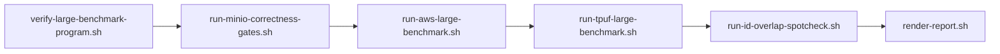

# Large-dataset benchmark harness — operator handoff (PR summary)

**Date:** 2026-06-04  
**Program:** [PLAN_LARGE_DATASET_BENCHMARK.md](../PLAN_LARGE_DATASET_BENCHMARK.md) — apples-to-apples openpuffer vs managed turbopuffer on a shared synthetic workload (L1 default: **100k × 128-dim** cosine).  
**Status:** **Offline harness COMPLETE** · **Live G3–G5 PENDING** (credentials + EC2)  
**Offline harness:** no remaining gaps

---

## Offline harness closure (2026-06-04)

All PLAN [verification checklist](../PLAN_LARGE_DATASET_BENCHMARK.md#verification-checklist-program-complete) rows are `[x]` for **offline** work (A1–A6 harness, G2 MinIO/CI, G6 regression, schemas, operators, exemplar G5). Unchecked `[ ]` items are **live only** (G3/G4/3.3 measured JSON, G5 measured report, [COMPARISON.md](../COMPARISON.md) L1 rows) and require EC2 + real AWS S3 + `TURBOPUFFER_API_KEY`.

Re-verified on this branch (iteration **81**, 2026-06-04):

```bash
./scripts/verify-large-benchmark-program.sh   # exit 0 @ af43e43 (2026-06-04T02:42:53Z; G2 skipped — pass --with-g2 for MinIO Docker parity)
```

No further offline harness implementation is planned before operator live G3–G5.

---

## TL;DR

This PR-equivalent handoff documents a **timeboxed implementation** (~60 harness commits, `6186190` … `f3103c8` on `main`) that delivers the full **evaluation harness** for the large-dataset comparison program: reproducible workload (G1), MinIO correctness gates (G2), scripted AWS/tpuf operators (G3/G4), report merge (G5), and CI/nightly regression (G6). **Measured comparison JSON and a publishable report are not included** — they require an operator with **real AWS S3**, **EC2 in the bucket region**, and a **turbopuffer test-org API key**.

| Track | State |
|-------|--------|
| Harness (A1–A6, G2, G6, schemas, operators) | **Done** — `./scripts/verify-large-benchmark-program.sh` exit **0** @ `af43e43` (2026-06-04T02:42:53Z; G2 optional, not run) |
| Live measurement (G3 `large-aws-l1.json`, G4 `tpuf-l1.json`, 3.3 overlap, G5 measured) | **Blocked** — see [§ Blocked on credentials](#blocked-on-credentials) |

**One command before any cloud spend:**

```bash
./scripts/verify-large-benchmark-program.sh
# or: make bench-verify
```

**One command for operator dry-run (documents env, no AWS/tpuf bill):**

```bash
./scripts/run-large-benchmark-program.sh --dry-run --tier l1
# or: make bench-dry-run
```

---

## Goals G1–G6

| Goal | Description | Harness | Live / publish |
|------|-------------|:-------:|:--------------:|
| **G1** | **Reproducible workload** — same vectors, ids, filters, and queries for both systems | **Done** | — |
| **G2** | **Correctness before latency** — API semantics, recall, filter/hybrid paths on shared fixture | **Done** (MinIO + CI `g2-minio-correctness`) | Optional AWS spot-check after G3 ingest |
| **G3** | **openpuffer scale proof** — tiered ingest + cold bench on **AWS S3** with committed JSON | **Done** (scripts, preflight, dry-run) | **Pending** — `benchmarks/results/large-aws-l1.json` |
| **G4** | **turbopuffer baseline** — same workload on managed API in aligned region | **Done** (driver, preflight, dry-run) | **Pending** — `benchmarks/results/tpuf-l1.json` |
| **G5** | **Comparison report** — methodology, raw numbers, interpretation | **Done** (skeleton + measured renderer + exemplar) | **Pending** — `docs/reports/BENCHMARK_VS_TURBOPUFFER_<date>.md` + [COMPARISON.md](../COMPARISON.md) L1 rows |
| **G6** | **Regression harness** — CI/nightly stays MinIO; AWS/tpuf manual but scripted | **Done** (dispatch dry-run, nightly program job) | Optional live workflow (`enable_live_run=false` default) |

**Program complete** = all live columns above checked + measured G5 published. Methodology defaults: [PLAN § Unresolved assumptions](../PLAN_LARGE_DATASET_BENCHMARK.md#unresolved-assumptions).

**Non-goals (unchanged):** MinIO latencies in the tpuf comparison report; claiming turbopuffer fleet SPFresh parity; production tpuf keys on bench hosts.

---

## What was built

### Phase A — Automation backbone (A1–A6)

| # | Deliverable | Path | Output |
|---|-------------|------|--------|
| **A1** | Deterministic workload generator + L1/L2/L3 manifests | `benchmarks/workloads/generate_synthetic.py`, `benchmarks/workloads/synthetic-128/{l1-100k,l2-500k,l3-1m}/` | `manifest.json`, `queries.json` (seed 42, `bench_sin_v1`) |
| **A2** | Tiered openpuffer ingest | `scripts/ingest-large.sh` | `ingest-large-{tier}.json` (+ S3 retry/resume, timing breakdown, serve readiness) |
| **A3** | Tiered openpuffer bench | `scripts/bench-large.sh`, `scripts/run-aws-large-benchmark.sh` | `large-aws-{tier}.json` (cold 7-run protocol, filter/hybrid, optional `--warm`) |
| **A4** | turbopuffer driver | `benchmarks/tpuf_driver/run_benchmark.py`, `scripts/run-tpuf-large-benchmark.sh` | `tpuf-{tier}.json` (ingest parity, cold/filter/hybrid/warm, recall) |
| **A5** | Report merge | `scripts/render-report.sh` | `docs/reports/BENCHMARK_VS_TURBOPUFFER_<date>.md` (dry-run + measured mode: schema, interpretation, redaction) |
| **A6** | CI dispatch | `.github/workflows/benchmark-large-dispatch.yml`, optional `benchmark-large-live.yml` | Dry-run gates default; live opt-in via secrets |

### Goals G2–G6 (harness surfaces)

| Goal | Key artifacts |
|------|----------------|
| **G2** | `scripts/run-minio-correctness-gates.sh`; `tests/integration_s3.rs` `synthetic_128_g2_*`; `tests/synthetic_workload_gate.rs`; CI job `g2-minio-correctness`; full `filter_queries` + `hybrid_queries` from `queries.json`; MinIO schema fast path (`--docs 10000`) |
| **G3** | `scripts/preflight-aws-ec2.sh`, `scripts/run-aws-large-benchmark.sh`, `scripts/lib/large-benchmark-preflight.sh` (rejects MinIO endpoint for live AWS JSON) |
| **G4** | `scripts/preflight-tpuf.sh`, `scripts/run-tpuf-large-benchmark.sh` (skips when `TURBOPUFFER_API_KEY` unset) |
| **G5** | `scripts/render-report.sh`, `docs/reports/BENCHMARK_VS_TURBOPUFFER_EXEMPLAR.md`, `benchmarks/report/fixtures/`, JSON schemas under `benchmarks/report/schema/` |
| **G6** | `scripts/verify-large-benchmark-program.sh`; nightly `large-dataset-program` in `nightly-stress.yml`; Makefile `bench-verify` / `bench-dry-run` / `bench-g2-minio` |

### Cross-cutting infrastructure

| Area | Implementation |
|------|----------------|
| **E2E orchestration** | `scripts/run-large-benchmark-program.sh` (G2 → G3 → G4 → id-overlap → G5; `--measured-report`, `--warm`) |
| **Offline verify gate** | `scripts/verify-large-benchmark-program.sh` (pytest, render tests, cargo `synthetic_workload_gate`, L1/L2/L3 dry-runs, JSON Schema, facts, shellcheck, git policy) |
| **Phase 3.3 id overlap** | `benchmarks/cross_check/`, `scripts/run-id-overlap-spotcheck.sh` → `id-overlap-{tier}.json` |
| **JSON contracts** | `schema_version: large_benchmark_v1`; `scripts/validate-benchmark-json.sh`; L1–L3 schemas; UTC timestamps; `scripts/normalize-benchmark-json.sh` |
| **ANN v3 gate** | `OPENPUFFER_ANN_VERSION=3` / `serve --ann-version 3`; `preferred_ann_version == 3` in artifacts and validate script |
| **Serve readiness** | `scripts/large-benchmark-serve-ready.sh` — `GET /v1/ready` (S3 deep probe) or `/health` |
| **API** | `GET /v1/ready` in Rust (integration-tested) |
| **Cost planning** | `scripts/estimate-large-benchmark-cost.sh` |
| **Git policy** | `.gitignore` live `large-aws-*` / `tpuf-*`; `scripts/check-benchmark-artifacts.sh`; explicit `git add -f` after operator review |
| **Hub docs** | `benchmarks/README.md`, `benchmarks/CHANGELOG_LARGE_DATASET.md`, `benchmarks/OPERATOR_RUNBOOK_QUICK.md` |

### Representative commit map

Full chronological list: [benchmarks/CHANGELOG_LARGE_DATASET.md](../../benchmarks/CHANGELOG_LARGE_DATASET.md).

| Area | Commits (sample) |
|------|------------------|
| A1 workload | `6186190`, `76ff071` |
| A2–A3 ingest/bench | `d788b65`, `9272b8f`, `98a9ff7`, `f877d64`, `d0bc8ba`, `5ccf9eb` |
| A4 tpuf | `08e66ce`, `696a247`, `5da0aa1` |
| A5 report | `59f5822`, `265c635` |
| G2 | `5972ab7`, `67c7050`, `2cccc7e`, `33a14d1` |
| G3/G4 operators | `a1b34cc`, `95197a9`, `ee30fd1`, `fa08a69` |
| E2E + verify | `250257b`, `bfaec74` |
| Schemas + policy | `c91c063`, `9670556`, `29f50fb` |
| Harness audit | `9d5b87b` @ verify `9670556` |

---

## Architecture (operator sequence)

Default tier **L1**; substitute `l2` / `l3` for stress tiers.



MinIO (G2) proves correctness only — **not** comparable latencies for [COMPARISON.md](../COMPARISON.md). Live G3 requires `OPENPUFFER_S3_ENDPOINT` matching `*amazonaws.com*` (or unset for derived AWS).

Detailed diagram and script names: [PLAN § Architecture](../PLAN_LARGE_DATASET_BENCHMARK.md#architecture-of-the-evaluation).

---

## How to verify

### 1. Offline harness (required before merge / operator spend)

```bash
./scripts/verify-large-benchmark-program.sh
```

| Flag | Effect |
|------|--------|
| `--skip-l2-l3` | L1 dry-run + shared gates only (faster) |
| `--with-g2` | Adds Docker MinIO G2 (`run-minio-correctness-gates.sh`) — CI parity, slower |
| `--skip-facts` | Skip `facts check` when facts CLI unavailable |

**Makefile equivalents:** `make bench-verify`, `make bench-dry-run`, `make bench-g2-minio`.

**Included gates (non-exhaustive):** pytest (workloads, tpuf driver, id-overlap); `test_render-report*.sh`; `validate-benchmark-json.sh`; `cargo test --test synthetic_workload_gate`; L1/L2/L3 harness dry-runs; `facts check --tags bench-large` / `bench-tpuf`; shellcheck; `check-benchmark-artifacts.sh`.

**Last full audit (iter 81):** 2026-06-04T02:42:53Z, git **`af43e43`**, exit **0** (offline harness; G2 optional — add `--with-g2` for MinIO Docker parity with CI).

### 2. Operator E2E dry-run (no cloud credentials)

```bash
./scripts/run-large-benchmark-program.sh --dry-run --tier l1
```

Documents AWS/tpuf env expectations; produces fixture-backed report skeleton — **not** live comparison timings.

### 3. MinIO correctness only (G2)

```bash
./scripts/run-minio-correctness-gates.sh
# MinIO JSON shape (not comparison timings):
./scripts/run-minio-large-schema-example.sh --tier l1
```

### 4. Live measurement (program complete)

Run on **EC2** (`m7i.xlarge`, same region as S3 bucket, e.g. `us-east-1`). Copy-paste sequence: [benchmarks/OPERATOR_RUNBOOK_QUICK.md](../../benchmarks/OPERATOR_RUNBOOK_QUICK.md).

```bash
unset OPENPUFFER_S3_ENDPOINT OPENPUFFER_S3_ACCESS_KEY OPENPUFFER_S3_SECRET_KEY
export OPENPUFFER_S3_BUCKET=openpuffer-bench-<account>-us-east-1
export OPENPUFFER_S3_REGION=us-east-1
./scripts/preflight-aws-ec2.sh
./scripts/run-aws-large-benchmark.sh --tier l1

export TURBOPUFFER_API_KEY=<test-org-key>
export TURBOPUFFER_REGION=aws-us-east-1
./scripts/preflight-tpuf.sh --tier l1
./scripts/run-tpuf-large-benchmark.sh --tier l1

./scripts/run-id-overlap-spotcheck.sh --tier l1
./scripts/run-large-benchmark-program.sh --tier l1 --measured-report
```

**Before commit:**

```bash
./scripts/validate-benchmark-json.sh benchmarks/results/large-aws-l1.json
./scripts/preflight-tpuf.sh --check-results benchmarks/results/tpuf-l1.json
./scripts/check-benchmark-artifacts.sh --staged
git add -f benchmarks/results/large-aws-l1.json benchmarks/results/tpuf-l1.json benchmarks/results/id-overlap-l1.json
```

### 5. Post-live facts (add when artifacts exist)

```bash
facts check --tags bench-large
facts check --tags bench-tpuf
facts check --tags "ann or cold"   # if ann/cold code touched
```

Placeholder `@spec` (`pending` / `skipped`): live `large-aws-l1.json`, `tpuf-l1.json` in [`.facts`](../.facts) — still manual: measured report, `id-overlap-l1.json` — [PLAN § Fact sheet](../PLAN_LARGE_DATASET_BENCHMARK.md#fact-sheet).

---

## Blocked on credentials

Live G3/G4 were **not** executed on the harness development host (2026-06-04). Evidence: [benchmarks/results/OPERATOR_G3_G4_ATTEMPT.md](../../benchmarks/results/OPERATOR_G3_G4_ATTEMPT.md).

**Attempt 3 (2026-06-04, `02398a8`):** **Blocked** — `OPENPUFFER_S3_ENDPOINT=http://127.0.0.1:9000` (MinIO, not `*amazonaws.com*`); `AWS_ACCESS_KEY_ID` unset; `TURBOPUFFER_API_KEY` unset. G3/G4 scripts not run; no live JSON committed.

| Requirement | Why blocked on dev host | Operator fix |
|-------------|-------------------------|--------------|
| **AWS S3** | `OPENPUFFER_S3_ENDPOINT=http://127.0.0.1:9000` (MinIO) | EC2 + dedicated `openpuffer-bench-*` bucket; unset MinIO endpoint |
| **EC2 / IMDS** | Not on EC2; no `aws` CLI for `head-bucket` | Launch `m7i.xlarge` in bucket region; instance profile or `OPENPUFFER_S3_*` |
| **`TURBOPUFFER_API_KEY`** | Unset | Test-org key per [turbopuffer Testing](https://turbopuffer.com/docs/testing); never commit |
| **Region alignment** | N/A until live | `TURBOPUFFER_REGION=aws-us-east-1` with `us-east-1` S3; run G4 from same EC2 as G3 |

**Guards that prevent bad commits:**

- `run-aws-large-benchmark.sh` / preflight reject non-AWS endpoints for live `large-aws-*.json`
- `.gitignore` + `check-benchmark-artifacts.sh` reject `environment=minio` on live comparison basenames
- Do **not** rename `*-schema-minio*.example.json` as measured AWS results

**Optional CI live path:** [docs/BENCHMARKS_GITHUB_ACTIONS_SECRETS.md](../BENCHMARKS_GITHUB_ACTIONS_SECRETS.md) — `benchmark-large-live.yml`, `enable_live_run=false` by default.

### Remaining deliverables (checklist)

- [ ] `benchmarks/results/large-aws-l1.json` (`environment=aws-s3`, `preferred_ann_version=3`)
- [ ] `benchmarks/results/tpuf-l1.json` (`environment=turbopuffer:<region>`)
- [ ] `benchmarks/results/id-overlap-l1.json`
- [ ] Measured `docs/reports/BENCHMARK_VS_TURBOPUFFER_<date>.md`
- [ ] [COMPARISON.md](../COMPARISON.md) L1 measured rows

---

## Key documentation index

| Document | Purpose |
|----------|---------|
| [PLAN_LARGE_DATASET_BENCHMARK.md](../PLAN_LARGE_DATASET_BENCHMARK.md) | Master plan: goals, phases, verification checklist, architecture, unresolved assumptions |
| [BENCHMARKS.md](../BENCHMARKS.md) | Operator runbook (G2–G6), env vars, SLO tables, EC2/tpuf setup, debugging |
| [COMPARISON.md](../COMPARISON.md) | Living maturity matrix; operator checklist (steps 1–5) |
| [PLAN_SPFRESH_AND_COLD_1M.md](../PLAN_SPFRESH_AND_COLD_1M.md) | Engine implementation (ANN v3, cold @ 1M) — sibling plan |
| [benchmarks/README.md](../../benchmarks/README.md) | Directory layout, JSON commit policy, script index |
| [benchmarks/CHANGELOG_LARGE_DATASET.md](../../benchmarks/CHANGELOG_LARGE_DATASET.md) | Harness commit chronology |
| [benchmarks/OPERATOR_RUNBOOK_QUICK.md](../../benchmarks/OPERATOR_RUNBOOK_QUICK.md) | EC2 one-page G3→G5 |
| [benchmarks/results/OPERATOR_G3_G4_ATTEMPT.md](../../benchmarks/results/OPERATOR_G3_G4_ATTEMPT.md) | Blocked live attempt log |
| [benchmarks/workloads/QUERY_SPEC.md](../../benchmarks/workloads/QUERY_SPEC.md) | `queries.json` structure (cold/warm/filter/hybrid/recall) |
| [benchmarks/workloads/EMBEDDINGS.md](../../benchmarks/workloads/EMBEDDINGS.md) | `bench_sin_v1` determinism rules |
| [benchmarks/workloads/synthetic-128/README.md](../../benchmarks/workloads/synthetic-128/README.md) | Tier manifests |
| [benchmarks/tpuf_driver/README.md](../../benchmarks/tpuf_driver/README.md) | G4 driver env and resume |
| [benchmarks/cross_check/README.md](../../benchmarks/cross_check/README.md) | Phase 3.3 id overlap |
| [benchmarks/report/README.md](../../benchmarks/report/README.md) | G5 fixtures and schemas |
| [docs/BENCHMARKS_GITHUB_ACTIONS_SECRETS.md](../BENCHMARKS_GITHUB_ACTIONS_SECRETS.md) | Optional CI live benchmarks |
| [docs/reports/BENCHMARK_VS_TURBOPUFFER_EXEMPLAR.md](BENCHMARK_VS_TURBOPUFFER_EXEMPLAR.md) | Report layout (`NOT MEASURED`) |

### Primary scripts

| Script | Role |
|--------|------|
| `scripts/verify-large-benchmark-program.sh` | Offline harness gate |
| `scripts/run-large-benchmark-program.sh` | E2E operator chain |
| `scripts/run-aws-large-benchmark.sh` | G3 AWS one-shot |
| `scripts/run-tpuf-large-benchmark.sh` | G4 tpuf one-shot |
| `scripts/run-minio-correctness-gates.sh` | G2 MinIO |
| `scripts/run-id-overlap-spotcheck.sh` | Phase 3.3 |
| `scripts/render-report.sh` | G5 merge |
| `scripts/validate-benchmark-json.sh` | JSON Schema + ANN v3 cross-check |
| `scripts/preflight-aws-ec2.sh` / `scripts/preflight-tpuf.sh` | Live preflight |
| `scripts/ingest-large.sh` / `scripts/bench-large.sh` | A2 / A3 stepwise |
| `scripts/estimate-large-benchmark-cost.sh` | Operator cost estimate |

---

## Relationship to SPFresh / cold @ 1M

| Plan | Owns |
|------|------|
| [PLAN_SPFRESH_AND_COLD_1M.md](../PLAN_SPFRESH_AND_COLD_1M.md) | Engine: probe planner, index v3, recall HTTP, `bench-1m.sh` |
| **This program** | Evaluation: shared workload, G2–G6 harnesses, AWS/tpuf JSON, comparison report |

Both require **`OPENPUFFER_ANN_VERSION=3`** for large-tier gates. L3 (1M) reuses cold/recall targets from the SPFresh plan; **L1 (100k)** is the default comparison tier.

---

## Reviewer / operator sign-off

| Question | Answer |
|----------|--------|
| Is the harness safe to merge? | Yes, if `verify-large-benchmark-program.sh` exits 0 on the target branch |
| Can we publish COMPARISON latencies from CI MinIO? | **No** — AWS + managed tpuf only |
| What unblocks “program complete”? | EC2 + real S3 + tpuf test key → runbook above → commit live JSON + measured report |
| Where is the blocked-run evidence? | [OPERATOR_G3_G4_ATTEMPT.md](../../benchmarks/results/OPERATOR_G3_G4_ATTEMPT.md) |

**Handoff author:** timeboxed harness session (see `/tmp/timeboxed-large-dataset-benchmark-plan-1780525473.md` progress log). **Next owner:** operator with AWS/tpuf credentials following [OPERATOR_RUNBOOK_QUICK.md](../../benchmarks/OPERATOR_RUNBOOK_QUICK.md).